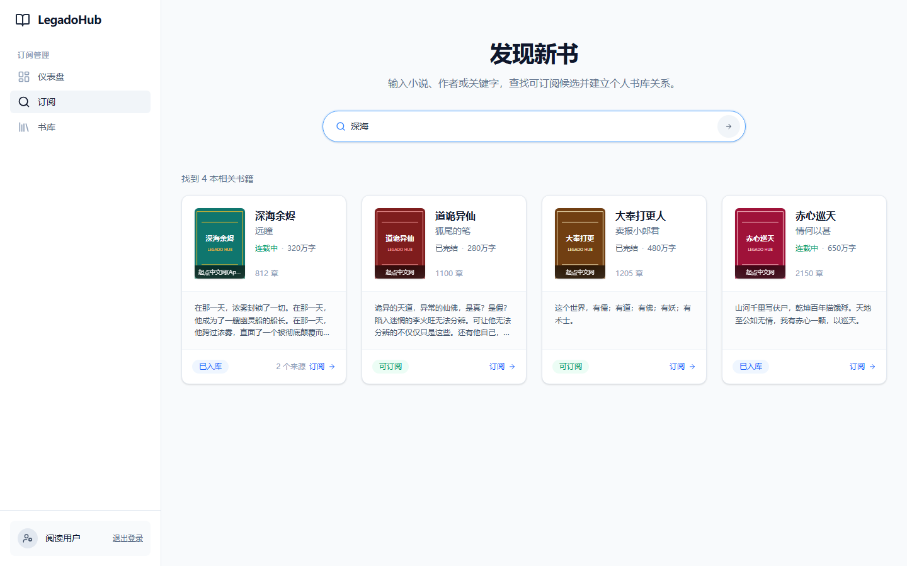

<div align="center">
  <h1>小说聚合订阅</h1>
  <p><strong>LegadoHub</strong></p>
  <p>把书源搜索、小说订阅、章节整理和持续更新放在一台服务上，最后回到 Reading/Legado 阅读。</p>
  <p>
    <a href="#快速开始">快速开始</a> ·
    <a href="#使用流程">使用流程</a> ·
    <a href="#接入-readinglegado">接入 Reading/Legado</a> ·
    <a href="#常见问题">常见问题</a> ·
    <a href="https://github.com/XziXmn/legado-hub/issues">问题反馈</a>
  </p>
  <p>
    <a href="#快速开始"></a>
    <a href="https://www.python.org/"></a>
    <a href="#接入-readinglegado"></a>
  </p>
</div>



## 这是什么

小说聚合订阅是一套面向 Reading/Legado 的自托管订阅服务。

管理员统一维护书源和官方源登录；受邀用户使用个人授权码登录，在 Web 控制台搜索并订阅小说。服务端负责聚合候选、复用共享书库、整理章节和检查更新，Reading/Legado 负责最终阅读。

项目仅支持本机或受控局域网部署，不提供开放注册、匿名阅读或内置公网模式。

## 核心能力

- **多源聚合**：同时搜索多个插件，合并同一本书的候选来源。
- **个人订阅**：每位用户拥有独立授权码、订阅关系和操作权限。
- **共享书库**：多人订阅同一本书时复用同一份章节数据，避免重复处理。
- **持续更新**：后台按订阅策略检查新章节，并展示处理、预览和失败状态。
- **书源管理**：统一管理第三方源、官方源登录、来源优先级和可达状态。
- **阅读交付**：向 Reading/Legado 提供搜索、详情、目录、正文和评论能力。
- **评论支持**：来源支持时可查看页热评、本章说和评论回复。

## 使用流程

```text
管理员部署服务并维护书源
            ↓
管理员创建用户并发放个人授权码
            ↓
用户在 Web 控制台搜索并订阅小说
            ↓
服务端聚合来源、整理章节并持续检查更新
            ↓
用户在 Reading/Legado 中阅读已发布内容
```

Web 控制台是订阅与管理入口，不是主要阅读器。阅读进度、翻页、排版和主题仍由 Reading/Legado 管理。

## 快速开始

### 准备环境

- Git
- Docker
- Docker Compose

### 1. 获取项目

```bash
git clone https://github.com/XziXmn/legado-hub.git
cd legado-hub
mkdir -p data config generated runtime plugins/sources/official
```

PowerShell：

```powershell
git clone https://github.com/XziXmn/legado-hub.git
Set-Location legado-hub
New-Item -ItemType Directory -Force data,config,generated,runtime,plugins/sources/official | Out-Null
```

### 2. 启动服务

默认部署不需要配置文件，直接启动即可。

```bash
docker compose config --quiet
docker compose pull
docker compose up -d
docker compose ps
```

默认从 Docker Hub 拉取 `xzixmn/legado-hub:latest` 多架构镜像，不在部署机编译源码。首次拉取耗时通常比后续更新更长。服务状态变为 `healthy` 后查看启动日志：

```bash
docker compose logs legadohub
```

空数据库首次启动时会自动创建管理员：

```text
用户名：admin
密码：启动日志中仅写入一次的随机密码
```

请在首次登录后立即修改密码。改密后日志中的旧密码失效，后续启动不会再次生成。

### 3. 打开服务

| 入口 | 默认地址 | 用途 |
|---|---|---|
| 管理控制台 | `http://127.0.0.1:8766/console` | 书源、用户、设置和全局任务 |
| 用户控制台 | `http://127.0.0.1:8765/login` | 搜索、订阅和个人书库 |
| 聚合书源 | `http://127.0.0.1:8765/api/subscribe/legado/source` | 导入 Reading/Legado |

两个端口默认都监听 `0.0.0.0`。其他局域网设备将 `127.0.0.1` 换成服务器 LAN IP 即可访问；管理员端口应通过宿主机防火墙限制来源。

## 首次使用

### 创建用户

1. 使用 `admin` 和首次随机密码登录管理控制台。
2. 打开“用户管理”。
3. 新建普通用户并填写便于识别的用户名。
4. 保存系统生成的个人授权码，再交给对应用户。

授权码仅在创建或重置后显示一次。重置授权码会立即使旧授权码和该用户已有会话失效。

### 订阅小说

1. 用户打开 `http://<服务器地址>:8765/login`，输入个人授权码。
2. 进入“订阅”，按书名、作者或关键字搜索。
3. 从聚合结果中确认作品，选择起始章节并创建订阅。
4. 在“我的书库”查看首批可读章节、处理进度和失败状态。

订阅成功不代表整本书会立即完成。首批章节可读后即可开始阅读，剩余章节和后续更新会继续在后台处理。

## 接入 Reading/Legado

### 1. 导入书源

```text
http://<服务器地址>:8765/api/subscribe/legado/source
```

手机不能使用服务器自身的 `127.0.0.1`，应替换为服务器的局域网地址。

### 2. 登录书源

1. 在 Reading/Legado 中找到“LegadoHub 聚合”。
2. 打开书源登录页。
3. 输入管理员发放的个人授权码并登录。
4. 检查登录状态是否显示自己的用户名。

### 3. 开始阅读

聚合书源只展示已经入库并发布的共享书。新增订阅、暂停、恢复和归档在 Web 控制台完成；Reading/Legado 只负责搜索和读取已发布内容。

## 局域网配置

Docker 默认监听所有网卡，不需要额外配置。假设服务器地址为 `192.168.1.20`：

```text
用户控制台：http://192.168.1.20:8765/login
管理控制台：http://192.168.1.20:8766/console
聚合书源：http://192.168.1.20:8765/api/subscribe/legado/source
```

通过哪个局域网地址请求聚合书源，服务端就会把该地址写入生成的书源规则。默认只接受私网 IP、`localhost` 以及 `.lan`、`.local`、`.home`、`.home.arpa` 局域网主机名，拒绝公网和任意单标签 Host 注入。

## 持久化目录

Docker 默认把运行数据映射到项目根目录：

| 宿主目录 | 容器目录 | 内容 |
|---|---|---|
| `./data` | `/app/backend/data` | 用户、订阅、书库、章节缓存和浏览器资料 |
| `./config` | `/app/backend/config` | 应用配置和插件 Cookie |
| `./generated` | `/app/backend/generated` | 生成的聚合书源 |
| `./runtime` | `/app/backend/runtime` | 插件运行状态 |
| `./plugins/sources/thirdparty` | `/app/plugins/sources/thirdparty` | 第三方插件，目录为空时从镜像初始化 |
| `./plugins/sources/official` | `/app/plugins/sources/official` | 人工安装的官方插件，容器内只读 |

替换或删除容器不会删除这些宿主目录。首次启动会由一次性初始化容器自动校正可写目录的所有者；主服务仍以 UID `1000` 非 root 用户运行。只有迁入了其他用户创建的旧文件且提示不可写时，才需要手工校正：

```bash
sudo chown -R 1000:1000 data config generated runtime plugins/sources/thirdparty
```

## 安装与管理插件

镜像已经附带第三方插件种子。宿主第三方目录为空时会在首次启动自动复制；目录非空后以宿主内容为准，不会在重启时覆盖人工更新。

官方插件不包含在公开镜像中。将获得的 Web 官方插件目录放到：

```text
plugins/sources/official/<插件 ID>/
```

然后重启：

```bash
docker compose restart legadohub
```

官方源能否读取完整内容，取决于插件能力、目标站状态、登录账号及该账号拥有的内容权限。

## 更新与备份

数据库、Cookie、共享正文和运行状态已经映射到宿主目录。更新镜像或替换容器时，这些数据会继续保留。

更新前仍建议停止服务并备份：

```bash
docker compose stop legadohub
# 备份 data、config、generated、runtime 四个目录
docker compose start legadohub
```

拉取部署文件和最新镜像：

```bash
git pull
docker compose pull
docker compose up -d
```

迁移服务器时复制上述四个目录和 `plugins/sources/official`，并在隔离实例中验证恢复结果。

## 外网访问边界

仓库不提供公网模式、内置穿透、公网反向代理或公网部署模板。使用者自行建立外网穿透时，TLS、域名、可信代理、防火墙、限流和管理员入口隔离也由使用者负责；应用仍按普通局域网实例运行。

## 常见问题

### 为什么 Reading 中搜不到刚订阅的书？

Reading 只展示已经入库并发布的共享书。先在“我的书库”确认是否已经出现可读章节。

### 为什么有的章节只有预览？

服务不会绕过目标站的付费规则和账号权限。账号无权读取完整正文、来源暂时失败或补充来源尚未通过校验时，章节可能只提供预览。

### 为什么书源显示可达，正文仍然失败？

可达只代表能够连接目标站，不代表页面结构、登录状态或章节权限一定可用。请在书籍详情中查看具体失败原因。

### 多个用户可以订阅同一本书吗？

可以。系统只维护一份共享章节数据，每个用户分别保存自己的订阅关系和设置。

### Web 控制台可以直接用来看小说吗？

控制台提供章节预览和评论验证，但不是完整阅读器。日常阅读应在 Reading/Legado 中完成。

## 维护者验证

[`verify.ps1`](verify.ps1) 是正式发布前的完整质量门禁，不是服务启动脚本，普通使用者无需运行。

```powershell
powershell -NoProfile -ExecutionPolicy Bypass -File .\verify.ps1
```

它会依次执行：

1. 后端 Python 编译、依赖检查和完整测试。
2. 所有已安装书源插件的契约校验。
3. 前端依赖审计、ESLint、组件测试和生产构建。
4. 控制台视觉对比和后端运行时导入检查。
5. 验证前后对运行数据、配置、Cookie 和生成文件做 SHA-256 摘要比较。

任何阶段失败，或验证过程修改了受保护的运行数据，脚本都会以失败结束。运行前需要已经准备好根目录 `.venv` 和 `frontend/node_modules`。

## 使用边界

- 仅在你有权访问和处理相应内容的前提下使用本项目。
- 遵守目标站服务条款、当地法律以及内容版权要求。
- 不要在公开仓库、日志或书源文件中保存 Cookie、密码、授权码和 API Key。
- 本项目不是 Legado 官方项目，不对第三方书源可用性或内容准确性作保证。

<p align="center">
  <a href="https://github.com/XziXmn/legado-hub/issues">提交问题</a> ·
  <a href="https://github.com/XziXmn/legado-hub">查看项目</a>
</p>
