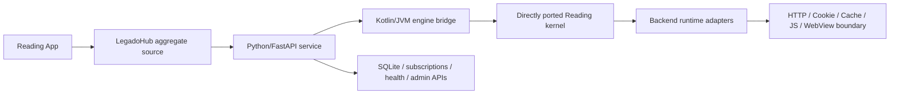

# LegadoHub Redesign Roadmap

> **For agentic workers:** This document is the current architecture source of truth. Do not revive deleted Python-rule-engine plans, and do not continue the self-written `AnalyzeRuleParser` route.

**Goal:** Build LegadoHub as a backend edition of Reading/Legado: Python manages service orchestration and UI APIs, while a Kotlin/JVM engine directly ports Reading source execution semantics.

**Architecture:** Python/FastAPI remains the local service, admin API, persistence, scheduling, SSE, aggregate-source provider, and article/content post-processing layer. Kotlin/JVM owns BookSource execution by directly porting upstream Reading kernel code and replacing Android dependencies with backend runtime adapters. Source compatibility is more important than preserving the current experimental parser.

**Tech Stack:** Python 3/FastAPI/SQLite for orchestration; Kotlin/JVM 2.x + Java 17 + coroutines + OkHttp + Rhino-compatible JS runtime for the engine; React/Vite/shadcn/ui for the later admin UI.

---

## Non-Negotiable Direction

1. Do not extend the old Python parser as the main engine.
2. Do not continue hand-rewriting Reading rule semantics in `legadohub.engine.rule.AnalyzeRuleParser`.
3. Directly port upstream Reading kernel files and keep their semantics recognizable.
4. Replace Android dependencies through adapters; do not simplify rules to fit the current backend.
5. Treat each Reading `BookSource` object as an independent source. Identity is `bookSourceUrl`, not website host.
6. Use XIU2/Yuedu as the built-in initial source subscription snapshot.
7. Python calls Kotlin in batches. Kotlin handles per-source execution, cancellation, timeout, trace, and concurrency.
8. UI/backend work starts only after the direct kernel port has an executable contract.
9. Keep BookSource execution and article post-processing as separate layers. Do not turn `engine-jvm` into a full Reading UI/content-display backend.

## Target Architecture



## Layer Boundary

LegadoHub has two different processing layers. They must not be mixed again.

### BookSource Management And Execution Layer

Owner: Kotlin/JVM `engine-jvm`, called by Python in batches.

Responsibilities:

- Import Reading `BookSource` JSON objects without grouping by host.
- Build requests through `AnalyzeUrl`, including URL options, `{{...}}`, `@js:`, `<js>`, headers, body, method, cookies, proxy flags, and WebView-required markers.
- Extract structured source data through `AnalyzeRule`: search results, book detail, toc, chapter content, explore/ranking lists, source variables, cookies, and trace.
- Execute extraction-critical JS helpers such as `java.ajax`, `java.get/post/head`, selector helpers, encoding/crypto helpers, and source variable helpers.
- Report structured failures: network, HTTP status, parse empty, JS error, WebView required, login required, timeout, proxy/runtime errors.

### Article And Content Post-Processing Layer

Owner: Python/FastAPI service after `engine-jvm` returns raw structured results.

Responsibilities:

- Final chapter text cleanup, including ad removal and common `replaceRegex` policy.
- Paragraph normalization, whitespace/layout cleanup, title decoration, user reading preferences, and presentation-facing formatting.
- Aggregation ranking, fallback source selection, cache orchestration, and API/UI response shaping.
- User-configurable post-processing rules that should not affect Reading BookSource compatibility.

Important boundary rule:

- If a behavior is required to fetch or parse the source field correctly, implement it in `engine-jvm`.
- If a behavior only changes the final article text for display or user preference, implement it in Python.

## Repository Boundaries

- `data/upstreams/luoyacheng-legado/`
  - Read-only upstream reference checkout.
  - Current semantic baseline: `44e07fea541287804cc58d0168940a756cd11cfd`.
- `engine-jvm/`
  - Kotlin/JVM engine.
  - Must become a direct port layer, not a fresh parser implementation.
- `app/`
  - Python service layer.
  - Must stop growing rule execution features once Kotlin bridge is available.
- `data/sources/raw/by-site/legado/sub-xiu2_yuedu.json`
  - Built-in initial source snapshot.
- `docs/architecture/legadohub-phase-1-kernel-port-plan.md`
  - Required implementation plan for the first stage.

## Engine Module Shape

The engine should be organized around two kinds of code:

- **Ported upstream code:** packages that preserve Reading naming and control flow as much as possible.
- **LegadoHub adapters:** backend replacement interfaces and bridge models.

Expected layout:

```text
engine-jvm/
  src/main/kotlin/
    io/legado/app/...                  # Directly ported upstream kernel files
    legadohub/engine/runtime/...       # Backend replacement interfaces
    legadohub/engine/bridge/...        # CLI/socket request-response boundary
    legadohub/engine/compat/...        # Android/JVM compatibility shims
  src/test/kotlin/
    legadohub/engine/port/...          # Upstream semantic regression tests
    legadohub/engine/bridge/...        # CLI/socket contract tests
```

## Delete-Or-Replace List

These files are acceptable only as temporary scaffolding. They must not remain the core engine after Phase 1:

- `engine-jvm/src/main/kotlin/legadohub/engine/rule/AnalyzeRuleParser.kt`
- `engine-jvm/src/main/kotlin/legadohub/engine/url/AnalyzeUrlParser.kt`
- `engine-jvm/src/main/kotlin/legadohub/engine/pipeline/WebBookPipeline.kt`
- Python rule execution modules under `app/legado_engine/`

When a direct upstream port covers the same responsibility, delete the self-written equivalent instead of preserving compatibility.

## Phase 1: Direct Reading Kernel Port

Phase 1 completes only when the Kotlin/JVM engine contains a direct upstream-derived execution path for:

- BookSource import.
- AnalyzeUrl request construction.
- AnalyzeRule extraction.
- JS extension bootstrap.
- Search/detail/toc/content web book flow.
- Explore/ranking source execution where it shares the same BookSource rule semantics.
- Batch source execution.
- CLI or process bridge that Python can call.

Phase 1 does not include the redesigned web admin UI.
Phase 1 also does not include a full Reading `ContentProcessor` port. JVM may keep extraction-critical helpers and currently supported common `replaceRegex` forms, but final article cleanup belongs to the Python post-processing layer.

Implementation plan:

- `docs/architecture/legadohub-phase-1-kernel-port-plan.md`

Acceptance commands:

```powershell
$env:JAVA_HOME='C:\Program Files\Eclipse Adoptium\jdk-17.0.19.10-hotspot'
$env:Path="$env:JAVA_HOME\bin;$env:Path"
$env:GRADLE_OPTS=''
data\upstreams\luoyacheng-legado\gradlew.bat -p . :engine-jvm:test --no-daemon
java -jar engine-jvm\build\libs\engine-jvm-0.0.1.jar version
java -jar engine-jvm\build\libs\engine-jvm-0.0.1.jar parse-source data\sources\raw\by-site\legado\sub-xiu2_yuedu.json
```

Expected:

- JVM tests pass.
- CLI version reports `0.0.1`.
- XIU2/Yuedu snapshot parses as 26 independent BookSource objects.
- Direct port tests prove upstream-derived flow, not self-written parser flow.

## Phase 2: Python Bridge And Backend Rewire

After Phase 1, Python must call the Kotlin engine instead of executing Reading rules itself.

Required outcomes:

- Batch search API starts one Kotlin batch job per request.
- Python stores source status, health, proxy state, failure reasons, and progress.
- Search API streams source progress and partial results.
- Detail/toc/content API calls Kotlin for source execution and Python for cache, fallback, aggregation, and final article post-processing.
- Old Python rule execution modules are deleted or isolated behind disabled legacy tests.
- `app/legado_engine/` must not grow Reading rule execution again, but Python may add a separate article post-processing package.

## Phase 3: Dynamic Web Admin UI

The admin UI is rebuilt as a real frontend application, not static HTML.

Required outcomes:

- React/Vite/TypeScript/shadcn/ui frontend.
- Chinese interface.
- Reading-inspired layout adapted for desktop web.
- No fake data.
- Source subscription management.
- Source list, source test, source trace, search progress, reading view, cache, settings, update tasks.
- Browser-driven click tests for major flows.

## Phase 4: Source Governance And Scale

Required outcomes:

- Per-source health state.
- Proxy fallback and user-forced proxy setting.
- Batch size defaults to 20 and is configurable.
- Per-host concurrency and global concurrency limits.
- Failure classification: engine gap, network, HTTP status, parse empty, login required, WebView required, JS error.
- Automatic disablement for hard failures.
- Manual retest and re-enable.

## Phase 5: Upstream Versioning

Required outcomes:

- Engine release version records upstream commit hash.
- Upgrade workflow is `sync upstream -> reapply adapters -> run regression`.
- Regression corpus includes XIU2/Yuedu and selected complex JS/WebView/login sources.
- The engine can be published independently from the Python service.

## Current Risk Register

- Direct port is larger than the previous self-written parser approach, but avoids long-term semantic drift.
- WebView-dependent sources may remain unsupported until a backend WebView runtime is selected.
- Login workflows need explicit backend product design.
- Rhino/GraalJS choice must be validated against upstream `JsExtensions` behavior before broad source testing.
- Existing Python tests may pass while source execution is still wrong; Phase 1 acceptance must be JVM-port centered.
- Over-porting Reading's display/content cleanup into JVM would blur the architecture again; keep JVM focused on BookSource execution.
