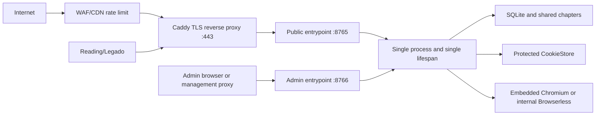

# 历史归档：公网 Reading 授权与安全加固实施规划

> 状态：已取消，不再作为产品路线或部署指南执行。
> 原规划日期：2026-07-19；最后一次历史验证：2026-07-20。
> 现行边界：应用只支持本机或受控局域网；外网穿透及其 TLS、反向代理、防火墙和限流由使用者自行负责。
> 保留原因：个人授权码、Session、权限隔离、攻击面与安全测试记录仍可作为实现依据。
> 2026-07-21 补充：下文“拒绝所有第三方插件直读”的历史条目已被现行契约替代。当前只允许授权用户通过启用、非官方、capability 匹配且 URL 位于插件声明域名内的第三方插件受控直读；官方、禁用、未知和跨域 ID 仍返回 404。

下文按原方案保留历史语境；其中 Compose、Caddy、WAF/TLS、公网发布步骤及“待放行”状态均已失效。现行产品边界以 `docs/PRODUCT.md` 和 README 为准。

## 实施状态摘要

| 阶段 | 当前状态 | 证据 |
|---|---|---|
| Phase A | 完成 | `docs/PRODUCT.md` 与订阅边界文档已同步 |
| Phase B | 完成 | 个人授权码、哈希 Session、schema v13、管理员密码迁移及回归测试 |
| Phase C | 完成 | Reading Bearer 门禁、聚合源边界、原生 `loginUi`、阅读限流与评论边界 |
| Phase D | 完成 | 普通用户/管理员双登录体验、一次性授权码展示、权限导航和明确身份刷新 |
| Phase E | LAN 完成 | `8765` 公共路由白名单、默认监听 `0.0.0.0:8766` 的管理控制面、单进程单 lifespan、非 root/只读容器、重启持久化、Host/Origin/Cookie 和安全头均已复验 |
| Phase F | 部分完成 | 自动化攻击矩阵、LAN 攻击 smoke、真实官方插件调用完成；安卓 Reading 与外部主动扫描未验 |
| Phase G | 本地与 LAN 门禁完成 | `verify.ps1` 通过、加密备份恢复演练通过 |

## 1. 原始背景与决策（历史）

实施前 LegadoHub 只承诺本机或受信局域网部署，Reading/Legado 兼容接口仍有匿名读取路径，Docker 默认直接发布 `8765`，登录、Host、TLS、速率限制和运行凭据保护尚未达到公网标准。

原计划曾把产品扩展为：**少量受邀用户通过公网使用同一 LegadoHub**。该公网方向现已取消；其中“每位用户只管理自己的订阅”和 Reading/Legado 鉴权能力继续保留在局域网实例中。

已确认的身份决策：

1. 管理员继续使用用户名和密码登录。
2. 普通用户不再面向“用户名 + 密码”交互，只使用管理员签发的个人授权码。
3. 授权码在服务端仍映射到现有 `users.user_id`，订阅归属、额度、审计和禁用继续复用现有用户体系。
4. 每位用户一个独立授权码，禁止全员共享码。
5. 授权码只用于兑换 Session，不随每次请求发送，不写入书源 URL、静态 `header`、日志或审计摘要。
6. Reading 使用 Bearer Session，Web Console 使用 HttpOnly Session Cookie；二者映射同一个 `user_sessions` 会话模型。
7. 官方起点及其他官方源 Cookie 仍只由管理员维护，普通用户永远不能读取、导出或直接调用官方插件私有接口。
8. 书源 JSON 可以匿名导入；搜索、详情、目录、正文、评论和订阅均必须完成授权。
9. 不提供“关闭 Reading 鉴权”的兼容开关，避免实例因错误配置重新变成匿名代理。
10. 管理员入口与公共 Reading 入口按监听端口分离：`8765` 不注册管理员认证、Console API、OpenAPI 或管理 SPA 路径；`8766` 承载管理员入口。
11. 两个端口由同一个进程和唯一 lifespan 管理，禁止为端口分离启动第二套订阅、Ping 或词库后台任务。

## 2. 目标与非目标

### 2.1 目标

- 用户在 Reading 的书源登录页输入一次授权码后，可以使用聚合书源。
- 同一身份可以进入普通用户 Console，搜索候选并管理自己的订阅。
- 已授权用户可以搜索和读取所有 `visible` 已发布共享书；只有显式订阅才创建个人订阅关系、占用用户额度或唤醒共享处理链。
- 用户 A 不能读取或修改用户 B 的搜索句柄、订阅设置和私有状态。
- 普通用户不能访问 Console 管理接口、插件直接读取接口、官方源认证、Cookie、Trace、内部 URL或文件路径。
- 授权码可重置，用户可禁用；两种操作都立即撤销现有 Session。
- 公网入口具备 TLS、Host/Origin 校验、应用与边缘限流、最小端口暴露和可审计的安全事件。
- 即使反向代理、Host Header 或前端路由被构造，公共端口也不能命中任何管理员后端路由。
- 发布前完成自动化回归、容器验证、真实 Reading 手机验证和受控渗透测试。

### 2.2 非目标

- 不建设 OAuth/OIDC 服务、JWT、刷新令牌体系或单独的授权微服务。
- 不支持开放注册、找回密码、邮箱验证、收费会员或社交账号登录。
- 不为每个用户生成一份带私密 Token 的书源 JSON。
- 不允许 Reading 的详情、目录或正文读取隐式创建订阅。
- 不在本阶段支持多进程、多副本共享限流或分布式 Session。
- 不承诺抵御运营商级或大规模流量型 DDoS；此类风险需要上游防火墙、CDN 或托管防护。
- 不用应用层加密伪装主机已失陷时的安全性；运行中进程必须能读取官方 Cookie，主机接管仍属于完全失陷。

## 3. 实施前风险基线

### 3.1 P0：公网前必须修复

| 风险 | 当前状态 | 目标状态 |
|---|---|---|
| Reading 匿名读取 | `/api/legado` 的 book/toc/chapter/reviews 无用户认证 | 除 source manifest 外全部要求有效用户 Session |
| 任意插件章节代理 | 非虚拟 chapter ID 可进入 `Catalog` | 普通用户只允许聚合虚拟源和已发布共享内容 |
| 订阅兼容面匿名枚举 | `/api/subscribe/legado/search`、explore 匿名 | Bearer 用户门禁和速率限制 |
| 无 TLS 边界 | `8765:8765` 直接对外 | 仅反向代理公开 443，8765 只绑定回环或内部网络 |
| Host 注入 | 书源和评论 URL 使用 `request.base_url` | 显式 `publicBaseUrl` + Trusted Host，拒绝伪造 Host |
| 登录暴力破解 | 管理登录和授权码兑换无限流 | IP + 用户标识双维度限制，统一 401，超限 429 |
| 管理密码明文等价存储 | `adminPasswordBase64` 可逆 | 管理员也只保留 PBKDF2 哈希，首启凭据不写日志 |
| Session 数据库泄漏可重放 | 原始 Session ID 直接存库 | 只存 Session Token 的 SHA-256 哈希 |
| `/api/info` 路径泄漏 | 匿名返回项目、配置、数据库绝对路径 | 管理员专用或删除路径字段 |
| 官方 Cookie 文件暴露 | bind mount 中为明文 JSON | 严格文件权限、加密备份、永不经普通用户 API 返回 |
| 管理控制面与 Reading 共用监听面 | 公共代理可以到达全部路由，再依赖角色判断 | 公共 `8765` 只注册用户/Reading 白名单；管理路由只存在于 `8766` |

### 3.2 P1：首个公网版本必须同时验证

- Cookie 鉴权写接口的 Origin/CSRF 防护。
- 登录、搜索、章节、评论和订阅的并发、速率和响应大小上限。
- 评论 HTML、书籍元数据、错误文本的 XSS 与 HTML 注入防护。
- 外部输入不能成为 URL、代理地址、插件 ID、文件路径或 shell 命令。
- Browserless/Chromium 端口、Token 和容器网络不能暴露到公网。
- 日志、Trace、异常响应和审计不得包含授权码、Session、Cookie、手机号全文或正文。
- 备份、恢复、撤销和凭据泄漏处置必须经过演练。

## 4. 目标身份模型

### 4.1 角色保持不变

| 角色 | 外部凭据 | 服务端身份 | 权限 |
|---|---|---|---|
| 匿名访问者 | 无 | 无 | `8765` 的 source manifest、授权码兑换页、最小健康检查 |
| 普通用户 | 个人授权码兑换出的 Session | `users.role=user` | `8765` 的 Reading 已发布内容、自己的订阅和搜索 |
| 管理员 | 用户名 + 密码兑换出的 Session | `users.role=admin` | `8766` 的普通用户能力 + 全部控制面 |
| 官方插件 | 宿主 CookieStore | 无外部用户身份 | 仅在宿主内部执行站点协议 |

Reading 不再使用共享的“部署级匿名身份”，而是携带普通用户身份。订阅模型不变，仍由 `(user_id, aggregate_book_id)` 决定所有权。

### 4.2 授权码格式

第一版采用：

```text
LH1.<base64url(username)>.<32-byte-random-secret>
```

约束：

- `LH1` 是格式版本，不是权限范围。
- username 仅用于定位现有用户，不作为秘密。
- secret 使用 `secrets.token_urlsafe(32)` 或等强度随机源。
- 完整授权码最多显示一次；服务端只保存 secret 的现有 PBKDF2-SHA256 哈希。
- 授权码可重复兑换，直到管理员重置授权码或禁用用户；“一次性”仅指明文只展示一次，不指兑换后立即失效。
- 未知用户、错误 secret、禁用用户和格式错误对外统一返回 `401 invalid_access_code`，不泄漏用户是否存在。
- 未知用户也执行固定的虚拟 PBKDF2 校验，降低用户名枚举的时序差异。

### 4.3 复用现有字段

- `users.role=admin`：`password_hash` 保持管理员密码哈希语义。
- `users.role=user`：`password_hash` 作为授权码 secret 哈希。
- 不新增 access-code/token 表。
- 普通用户创建接口只接收显示名称，由服务端生成授权码。
- 普通用户重置操作返回新授权码一次，并删除该用户全部 Session。
- 禁用用户沿用现有行为，立即删除全部 Session。

如果以后必须支持“一个用户多个独立设备凭据、单设备撤销、邀请码过期或细粒度 scope”，再新增凭据表；第一版不提前建设。

### 4.4 Session 契约

- 原始 Session Token 继续使用至少 32 字节随机值。
- 客户端持有原始 Token；数据库只保存 `sha256(token)`。
- Web 使用 `legadohub_session` HttpOnly/Secure/SameSite Cookie。
- Reading 使用 `Authorization: Bearer <token>`。
- Bearer 出现时优先按 Bearer 认证；格式错误或无效时直接 401，不回退 Cookie。
- Session 过期、用户禁用、授权码重置和管理员撤销都必须在下一次请求生效。
- 第一版不增加 refresh token；Session 过期后重新输入授权码。
- 单个普通用户最多保留 3 个有效 Session；新兑换超限时删除最早的普通用户 Session，并记录不含 Token 的审计事件。
- Session 创建、过期清理和数量裁剪必须在同一个 `BEGIN IMMEDIATE` 事务内完成，避免并发兑换突破上限。

### 4.5 迁移规则

本阶段将数据库从 v12 提升到 v13，并执行可重复迁移：

1. 备份数据库、配置和 CookieStore。
2. 清空现有 `user_sessions`，要求所有用户重新登录，避免原始和哈希 Session 语义混用。
3. 新 Session 只把 Token 哈希写入现有 `session_id` TEXT 主键；不新增列。
4. 将现有管理员配置密码重新写入数据库 PBKDF2 哈希。
5. 数据库密码哈希与迁移 marker 在同一事务提交；marker 提交后数据库立即成为唯一认证真相，旧配置值即使仍在文件中也不得再次应用。
6. 随后原子删除 `auth.adminPasswordBase64`。若配置保存失败，必须终止启动并保留旧文件；下次启动根据 marker 只重试删除这个已失效的残留值，禁止重新应用密码。
7. 现有普通用户可以由管理员重置为新授权码；不自动输出、恢复或猜测旧密码。
8. 迁移不得删除用户、订阅、共享书、章节文件或官方 Cookie。

## 5. API 与权限契约

### 5.1 新增或调整的认证接口

| 方法 | 路径 | 身份 | 说明 |
|---|---|---|---|
| POST | `/api/auth/access/redeem` | 匿名 | 授权码兑换 Session；设置 Cookie 并返回 Reading Token |
| GET | `/api/auth/access/me` | User/Admin | 返回明确 `userId/username/role`；缺少明确身份不算登录成功 |
| POST | `/api/auth/access/logout` | User/Admin | 撤销当前 Bearer 或 Cookie Session |
| POST | `/api/auth/login` | 匿名 | 仅管理员用户名 + 密码登录 |
| POST | `/api/console/users` | Admin | 普通用户由服务端生成授权码；管理员仍显式设置密码 |
| POST | `/api/console/users/{id}/reset-access-code` | Admin | 返回新授权码一次并撤销全部 Session |
| POST | `/api/console/users/{id}/revoke-sessions` | Admin | 不禁用用户，只撤销当前全部 Session |

`/api/auth/access/redeem` 响应示例：

```json
{
  "ok": true,
  "token": "<returned-once-session-token>",
  "expiresAt": "2026-08-18T00:00:00Z",
  "user": {
    "userId": "...",
    "username": "朋友甲",
    "role": "user"
  }
}
```

服务端日志、Trace、审计和错误响应都不得记录 `code` 或 `token`。

### 5.2 双端口路由矩阵

| 路由/能力 | 公共入口 `8765` | 管理入口 `8766` |
|---|---|---|
| `GET /health` | 匿名 200，最小状态 | 匿名 200，最小状态 |
| `GET /api/auth/entrypoint` | 返回 `public` | 返回 `admin` |
| `POST /api/auth/access/redeem`、`/access/me`、`/access/logout` | 注册；普通用户授权流程 | 不注册，返回 404 |
| `POST /api/auth/login|change-password` | 不注册，返回 404 | 注册；仅管理员凭据 |
| `POST /api/auth/bootstrap` | 不注册，返回 404 | 不注册；首个管理员只能由受限 secret 在启动时创建 |
| `GET /api/subscribe/legado/source` | 匿名 200 | 管理员可访问完整服务面 |
| Reading 搜索、book、toc、chapter、reviews | 匿名 401；User/Admin 仅聚合已发布内容 | 管理员可用于诊断，但仍受内容边界约束 |
| 用户搜索、个人书库、订阅配置 | User/Admin 仅自己的资源 | 管理员可使用完整服务面 |
| `/api/subscribe/library`、source-map refresh、cancel | 不注册，返回 404 | Admin 允许 |
| `/api/info`、`/api/console/*`、官方源登录、Cookie、插件治理 | 不注册，返回 404 | 匿名 401、User 403、Admin 允许 |
| `/openapi.json`、`/docs`、`/redoc` | 不注册，返回 404 | 管理入口可用 |
| `/console`、订阅、个人书库及书籍详情 SPA | 注册 | 注册 |
| 插件、设置、用户、搜索工作台、管理章节 SPA | 不注册，返回 404 | 注册 |

端口隔离是服务端路由注册边界，不依赖前端隐藏、Host Header、角色判断或代理重写。管理员 Cookie 即使因同主机不同端口而被浏览器同时携带到 `8765`，公共前端也按普通用户视图渲染，控制面路由仍不存在。

### 5.3 Reading 内容边界

- 普通用户只能访问 `legadohub_ai_aggregate` 虚拟源及 `visible` 已发布共享内容。
- 直接提交 `qidian_com_app:*`、`qidian_com_web:*` 或任意第三方插件章节 ID 对普通用户返回 404，不进入插件执行。
- Reading 搜索和阅读不会创建订阅、入队、刷新 source-map、注册 TOC 或执行维护。
- 已授权用户可以读取其他用户已促成发布的共享书，因为正文是共享资产；这不创建其个人订阅。
- 新建或持续跟踪一本书仍需要当前用户显式订阅，并接受现有订阅额度。
- 评论请求需要授权、分页上限、用户级速率限制和同章短期缓存，避免直接放大官方 App API 调用。

## 6. Reading/Legado 登录设计

本地参考源 `docs/archive/光遇聚合26.6.9.json` 和 `docs/archive/书山聚合.json` 已验证可使用 `loginUi`、`source.getLoginInfoMap()`、`source.putLoginHeader()` 和 CookieJar 完成原生书源登录。

### 6.1 `loginUi`

第一版只保留必要控件：

```json
[
  {"name": "授权码", "type": "password"},
  {"name": "登录", "type": "button", "action": "login()"},
  {"name": "登录状态", "type": "button", "action": "checkLogin()"},
  {"name": "订阅管理", "type": "button", "action": "openSubscriptions()"},
  {"name": "退出登录", "type": "button", "action": "logout()"}
]
```

### 6.2 登录脚本规则

1. 从 `source.getLoginInfoMap()` 读取授权码。
2. 只向当前书源的固定 HTTPS `publicBaseUrl` 发送兑换请求。
3. 成功响应必须同时包含 Token 和明确 username；缺少身份字段视为失败。
4. 用 `source.putLoginHeader()` 保存 Bearer Session。
5. 清空 `source.putLoginInfo()` 中的授权码，避免长期保存原始码。
6. 禁止 `java.log()` 输出授权码、响应体、Token 或 Authorization Header。
7. `loginCheckJs` 调用 `/api/auth/access/me`，只有明确返回 username 才显示已登录。
8. 退出时先调用服务端撤销接口，再清空 Login Header 与同域 Cookie。

### 6.3 Console 会话衔接

兑换接口同时设置同域 HttpOnly Cookie。Reading 登录脚本保存 Bearer，并通过同域 CookieJar 让“订阅管理”按钮打开普通用户 Console。

第一阶段先复用 Reading 已有 CookieJar，不增加 URL 中的一次性跳转票据。必须在真实 Reading 安卓端验证 WebView 是否携带同域 Cookie；只有实测不共享时，才增加 60 秒、单次消费的 Console handoff ticket。即使增加 handoff，也禁止把 Session Token 放进 URL。

### 6.4 书源导出安全

- 导出的书源 JSON 只能包含登录脚本和公共 URL，不包含 Login Header、授权码、Session 或用户信息。
- 更新或重新导入书源不能静默覆盖当前用户的本地凭据；该行为必须用真实 Reading 验证。
- `bookSourceUrl` 和所有 API URL 来自服务端固定 `publicBaseUrl`，不接受请求 Host 拼接结果。

## 7. 公网部署拓扑



强制边界：

- 公共 Reading 流量只经 443 进入 `8765`；80 仅用于重定向到 HTTPS。
- 管理端口 `8766` 按产品决定默认监听宿主 `0.0.0.0`。应用不代替部署方决定其网络暴露；防火墙、转发、TLS、VPN/管理网段 ACL 必须由部署方配置并验收。
- 未经明确管理网络策略，禁止把 `8766` 直接放行给不受信公网；Caddy 的公共站点只反代 `8765`。
- Browserless `3000` 只允许内部网络访问，使用随机 Token，禁止默认值。
- WAF/CDN 负责基础 IP/连接限流和公网攻击流量吸收；stock Caddy 负责 TLS 证书、请求体上限、连接超时和安全响应头。
- 公共 Compose 在未显式确认边缘限流已经配置并通过 429/真实客户端 IP 验证时拒绝渲染；确认变量不是限流实现，禁止空填绕过。
- 应用只信任明确反向代理地址提供的 Forwarded Header。
- 设置显式 `LEGADOHUB_PUBLIC_BASE_URL=https://books.example.com`；公网部署缺失或不是 HTTPS 时启动失败。
- Trusted Host 只允许正式域名和测试域名，不允许 `*`。
- 不配置通配 CORS；Console 与 API 保持同源。
- 公共和管理入口分别使用 `LEGADOHUB_*` 与 `LEGADOHUB_ADMIN_*` 的精确 Base URL、Allowed Host、Allowed Origin 和 Trusted Proxy 配置。
- 反向代理不得缓存 `/api/*` 的认证响应；认证、用户和订阅响应设置 `Cache-Control: no-store`，避免把某个用户的 200 响应交给匿名或其他用户。
- Cookie 必须为 `Secure; HttpOnly; SameSite=Lax; Path=/`。
- Cookie 鉴权的 POST/PUT/PATCH/DELETE 必须验证 Origin；Bearer 请求不依赖浏览器环境，但仍执行权限和限流。

### 7.1 容器与文件

- 容器使用非 root 用户；若嵌入 Chromium 需要额外目录，只给 `/tmp` 和明确的浏览器缓存 tmpfs。
- 启用 `no-new-privileges`，移除不需要的 Linux capabilities。
- 配置 CPU、内存、PID、连接数和日志大小限制。
- `backend/config`、`backend/data`、`backend/generated` 仅挂载必要可写目录。
- `backend/config`、CookieStore 和备份目录权限为目录 700、文件 600。
- 镜像内置起点 Web 源和全部第三方插件；其他官方插件不进入镜像。第三方与官方宿主目录都是可写覆盖层，镜像仅补齐缺失的插件 ID。
- 宿主可在覆盖层新增插件，或用同 ID 目录替换镜像版本；宿主版本始终优先，入口不会自动覆盖已有目录。
- 管理员密码、Browserless Token、备份密钥通过 Docker secret 或宿主受限环境文件注入，不写镜像、Compose 默认值或 Git。
- 备份必须加密；恢复演练只能在隔离目录和隔离容器进行。

## 8. 应用安全控制

### 8.1 限流与容量

初始门禁：

| 动作 | 应用层默认 | 边缘层要求 |
|---|---|---|
| 授权码/管理员登录失败 | 每 IP 5 次/10 分钟，每用户标识 5 次/10 分钟 | 同 IP 突发限制和连接限制 |
| Reading 搜索 | 每用户 20 次/分钟 | 请求体与连接超时 |
| book/toc | 每用户 120 次/分钟 | 缓存与并发限制 |
| chapter | 每用户 120 次/分钟，最多 4 并发 | 响应大小和上游超时 |
| reviews | 每用户 30 次/分钟，最多 2 并发 | 同章缓存和分页上限 |
| 订阅创建/更新 | 沿用现有用户额度 | 禁止匿名请求进入应用队列 |

应用限流继续基于当前单进程模型；反向代理限流负责重启窗口和匿名攻击。升级多 worker 前必须把 Session 限制、限流和共享锁迁移到 SQLite 原子预留或外部协调组件。

### 8.2 输入与输出边界

- 授权码、用户名、搜索词、ID、page/pageSize 和订阅字段必须有长度、类型和范围限制。
- FastAPI DTO 禁止继续用无字段约束的任意 `dict` 承接公网认证请求。
- 未知字段返回 422；不能静默接受 URL、pluginId、proxy、headers 或内部路径。
- SQL 只允许参数化查询。
- 文件路径只由服务端稳定 ID 生成，并在解析后确认仍位于目标根目录下。
- HTML 评论和所有用户/远端文本先 escape，再插入受控标签。
- 图片 URL 只允许既有 HTTPS CDN allowlist。
- 错误响应不包含堆栈、内部路径、Cookie、Authorization、插件原始 body 或正文。

### 8.3 外部请求与 SSRF

- 普通用户请求不能提供任何目标 URL、代理 URL或插件 ID。
- 公网 Reading 不能进入通用 `Catalog` 插件直读路径。
- 管理员配置的插件仍按 manifest 域名运行；重定向、DNS 与代理边界由宿主控制。
- 生产容器通过网络策略阻断云元数据地址和不需要的内网网段。
- SSRF 测试只能指向本地 mock server，不向真实云元数据、路由器或第三方服务发包。

### 8.4 日志与审计

允许持久化的授权审计：

- `user.access_code.issue`
- `user.access_code.reset`
- `user.access_code.redeem`
- `user.sessions.revoke`
- `user.disable/enable`

审计只记录 actor、target user、结果、时间和 correlation ID。禁止记录授权码、Session、Authorization、Cookie、完整 IP、手机号全文和请求体。高频失败登录只做聚合计数或受限安全日志，不能用攻击流量无限增长数据库。

## 9. 分阶段实施计划

遵循项目测试规则：阶段内完成相关修改后集中测试，不在每写一小段代码后运行完整测试；最终发布前再运行全量门禁。

### Phase A：契约与安全基线

修改：

- 更新 `docs/PRODUCT.md`，增加公网受邀用户阶段。
- 更新订阅边界文档：Reading 从部署级匿名客户端变为用户 Session 客户端。
- 固定公网路由矩阵、授权码语义、Session 迁移和回滚规则。
- 对真实运行数据做只读摘要，确认迁移保护范围。

阶段验证：文档交叉引用、路由清单和现状测试基线；不修改运行数据。

### Phase B：凭据、Session 与管理员迁移

修改范围：

- `backend/app/services/user_auth.py`
- `backend/app/api/auth.py`
- `backend/app/storage/db.py`
- `backend/app/api/console.py` 的用户管理接口
- `frontend/src/routes/UsersPage.tsx`

实现：

- 普通用户授权码生成、解析、PBKDF2 校验和一次展示。
- Bearer/Cookie 共用的 Session 解析入口。
- Session 哈希落库、过期清理、并发 Session 上限和撤销。
- 管理员密码从 base64 配置迁移到数据库哈希。
- 登录限流、统一错误和不泄漏审计。

阶段测试：授权码格式、成功/失败兑换、时序枚举保护、Session 哈希、过期、重置、禁用、撤销、管理员兼容、迁移回滚和运行数据保护。

### Phase C：Reading 路由门禁与书源登录

修改范围：

- `backend/app/core/legado_source.py`
- `backend/app/api/legado.py`
- `backend/app/api/subscribe.py`
- `backend/app/services/reading_reviews.py`
- 必要的共享读取服务，不新增第二套认证模块

实现：

- source manifest 添加 `loginUi/loginUrl/loginCheckJs`。
- `/api/legado` 与 `/api/subscribe/legado` 使用统一用户依赖。
- 普通用户只允许聚合虚拟源，拒绝直接插件 ID。
- Reading 搜索/详情/目录/正文保持纯读取。
- 章节与评论用户限流、并发和分页门禁。
- 明确 `publicBaseUrl`，不再信任任意 Host 生成外部 URL。

阶段测试：manifest 快照、登录脚本静态检查、匿名 401、合法 Bearer 200、错误 Bearer 401、插件 ID 拒绝、Reading 不写数据库/不入队、评论 XSS 和分页边界。

### Phase D：普通用户 Console 授权体验

修改范围：

- `frontend/src/routes/LoginPage.tsx`
- `frontend/src/routes/UsersPage.tsx`
- `frontend/src/lib/api.ts`

实现：

- 默认普通用户授权码登录。
- 管理员登录作为明确的次级入口，继续用户名 + 密码。
- 用户创建和重置只显示一次授权码，关闭后不可再次读取。
- 登录、过期、撤销、429、403 和离线状态有明确中文反馈。
- 普通用户登录后只看到订阅与自己的书库。

阶段测试：组件测试、键盘与焦点、错误态、一次展示、权限导航、移动端布局、lint 和 build。

### Phase E：公网部署加固

修改范围：

- `backend/app/main.py` 的 Trusted Host、Origin 和安全响应头
- `backend/app/server.py` 的单进程端口分发与唯一 lifespan 所有权
- `docker-compose.yml` 或单独的公网 override
- 反向代理示例配置和部署文档
- CookieStore 权限、日志和首启凭据输出

实现：

- 外部 WAF/CDN 限流门禁、TLS、固定 Host、可信代理链、请求体/连接超时和安全头。
- 8765/3000 内部化。
- `8765` 只注册 Reading/普通用户白名单，`8766` 只提供管理员认证和完整控制面；公共代理永不转发到 `8766`。
- 非 root、最小 capabilities、资源限制和日志轮转。
- 管理员凭据与 Browserless Token 通过外部 secret 注入。
- `/api/info` 收口。
- 加密备份与隔离恢复流程。

阶段测试：Compose config、端口扫描、TLS/header、容器用户/权限、伪造 Forwarded Header、磁盘权限、日志泄漏和恢复演练。

### Phase F：受控攻防与真实客户端验收

- 在一次性测试数据库、虚拟 CookieStore 和 mock 外站环境运行本文件第 11 节攻击矩阵。
- 从独立安全工作站运行 ZAP、SQLMap 和端口扫描，不在磁盘紧张的部署服务器安装或拉取扫描镜像。
- 用真实 Reading 安卓端完成导入、授权、搜索、订阅管理、阅读、评论、重启、撤销和重新登录。
- 修复所有 P0/P1 发现后重新执行本阶段，不以“已知风险”跳过。

### Phase G：最终发布门禁

- 运行定向安全测试、全部后端测试、前端测试/lint/build、插件 validator、Docker smoke、真实 APP/Web 插件调用和 `verify.ps1`。
- 对 `backend/data`、`backend/config`、`backend/generated`、`backend/runtime` 和插件 Cookie 路径做前后 SHA-256 摘要。
- 只有验证通过后才能提交、推送、更新版本或公开 DNS。

## 10. 自动化测试规划

### 10.1 测试文件

- 新增 `dev-assets/tests/test_public_authorization.py`，并在 `.gitignore` allowlist 中明确跟踪。
- 新增 `dev-assets/tests/test_admin_entrypoint.py`，覆盖双端口路由、SPA、OpenAPI、编码路径和 lifespan 隔离。
- 扩展 `dev-assets/tests/test_plugin_console_api.py`：用户管理、管理员登录、授权码一次展示和权限矩阵。
- 扩展 `dev-assets/tests/test_reading_loop_api.py`：Reading Bearer、manifest 登录字段、纯读取不变量和直接插件 ID 拒绝。
- 扩展 `dev-assets/tests/test_user_subscriptions.py`：Bearer 用户的 owner、配额、并发和重启行为。
- 新增 `frontend/src/routes/LoginPage.test.tsx`。
- 扩展 `frontend/src/routes/UsersPage.test.tsx`。

所有后端测试必须继续使用 `dev-assets/tests/conftest.py` 的临时 DATA/CONFIG/GENERATED/RUNTIME/DB/COOKIE 路径，禁止接触真实 CookieStore。

### 10.2 授权码与 Session 用例

1. 创建普通用户只返回一次授权码，数据库和后续列表无明文。
2. 授权码 secret 长度、字符集、版本和 username 编码符合契约。
3. 正确授权码返回明确 username、Session Token 和过期时间。
4. 错误格式、未知用户、错误 secret、禁用用户都返回相同 401 结构。
5. 授权码、Token、Authorization 不出现在日志、审计、异常或响应 debug。
6. Session 数据库只包含 SHA-256，不包含原始 Token。
7. Bearer、Cookie 分别能解析同一用户。
8. 无效 Bearer 存在时不回退合法 Cookie。
9. Bearer 与 Cookie 同时存在且属于不同用户时，严格遵循 Bearer 优先，不产生权限并集或身份漂移。
10. Session Cookie 为 host-only，且包含 Secure、HttpOnly、SameSite=Lax、Path=/；HTTP 环境不能产生可用于公网的弱 Cookie。
11. Session 过期后 401 并删除数据库记录。
12. 重置授权码后旧授权码和全部旧 Session 失效。
13. 禁用后全部 Session 失效；重新启用不恢复旧 Session。
14. 第 4 个 Session 兑换后最早 Session 失效，其余仍有效。
15. 并发兑换不会突破 Session 上限。
16. 管理员不能使用普通用户授权入口绕过管理员密码策略。
17. 未知用户路径确实执行虚拟 PBKDF2；CI 不使用易波动的严格毫秒差作为唯一断言。
18. v12 升级后旧 Session 被明确清空，用户、订阅、共享书和 Cookie 摘要不变。

### 10.3 路由权限与 IDOR 用例

对每条公网路由覆盖匿名、用户 A、用户 B、管理员：

- 匿名 Reading 搜索、book、toc、chapter、reviews 返回 401。
- 普通用户访问 `/api/console/*` 返回 403。
- 公共 `8765` 上的管理员登录、`/api/info`、`/api/console/*`、管理 SPA、SSE 和 OpenAPI 一律 404；不能因管理员 Cookie、Bearer 或编码路径变成 200。
- 管理 `8766` 不注册授权码兑换接口；普通用户 Bearer 不能被 `/api/auth/me` 认定为管理入口登录。
- 用户 A 查询或修改用户 B 的搜索 job、订阅和私有详情返回 404，避免泄漏存在性。
- 猜测或枚举 bookId/chapterId/jobId 不增加权限。
- `qidian_com_app:*`、`qidian_com_web:*` 和第三方插件 ID 对普通用户不执行插件，返回 404。
- source manifest 和 `/health` 保持匿名可用。
- `/api/info` 匿名 401、普通用户 403。
- Reading 详情、目录、正文和评论请求前后，数据库任务数、订阅数和队列状态完全一致。
- 认证与订阅响应带 `Cache-Control: no-store`；反向代理不会把用户 A 的响应缓存给用户 B 或匿名请求。
- 恶意 Origin 的预检和实际请求都不返回通配 `Access-Control-Allow-Origin`。

### 10.4 限流与并发用例

- 同 IP 第 6 次错误兑换在窗口内返回 429 和 `Retry-After`。
- 不同 IP 不共享 IP 计数，但相同用户标识仍受标识维度限制。
- 成功登录不能无限清空失败计数。
- Reading 搜索、章节和评论达到上限时返回标准 429，不返回 HTTP 200 + error。
- 用户 A 的流量不消耗用户 B 的用户级额度。
- 超过章节/评论并发上限时拒绝或排队在固定上限内，不创建无界任务。
- 进程重启后应用内窗口可能清空，但反向代理窗口仍生效。
- 两个并发兑换事务同时看到 2 个现有 Session 时，最终有效 Session 仍不超过 3 个。

### 10.5 前端用例

- 普通用户默认只看到授权码输入。
- 管理员入口明确且不会误提交到授权码接口。
- 授权码创建/重置只展示一次，复制按钮不把内容写日志。
- 401 返回登录页；403 显示权限不足；429 显示可重试时间。
- 禁用、重置和 Session 过期后缓存用户状态立即清理。
- 键盘可操作、焦点可见、密码输入不显示明文、移动端不溢出。

## 11. 受控渗透与反向攻防矩阵

### 11.1 执行边界

所有攻击测试必须满足：

- 目标只能是 `127.0.0.1`、专用测试 LAN 或明确的 staging 域名。
- 使用一次性数据库、虚拟用户和虚拟 Cookie，不加载真实起点 `cmfuToken/ywkey/ywguid`。
- SSRF 目标使用本地 mock server；禁止访问真实云元数据、路由器管理页或第三方站点。
- DoS 只验证应用上限，不追求压垮主机；设置请求数、并发和最长执行时间。
- SQLMap/ZAP 等主动扫描只能从独立安全工作站运行，不能对生产域名执行。
- 每轮记录目标版本、测试账号、开始/结束时间、请求上限、发现、日志证据和清理结果。

### 11.2 攻击矩阵

| 类别 | 受控输入/动作 | 目标 | 必须满足的防守结果 |
|---|---|---|---|
| 认证绕过 | 无 Header、空 Bearer、Basic、大小写/空白变体 | Reading/subscribe/console | 401；不能回退匿名或 Cookie |
| 重复 Header | 两个 Authorization、Bearer 中含逗号 | 用户路由 | 400/401；不选择攻击者有利值 |
| Session 固定 | 登录前设置伪造 Cookie，再兑换 | access/redeem | 生成全新 Session，不沿用旧值 |
| Session 重放 | 在第二客户端复用捕获的测试 Token | chapter/me | 撤销前按同一用户；撤销后立即 401 |
| 授权码暴力破解 | 同 IP 连续错误码 | access/redeem | 第 6 次 429；日志无完整码 |
| 用户枚举 | 已存在/不存在 username 前缀 + 错 secret | access/redeem | 相同状态、消息和近似计算路径 |
| IDOR | 用户 A 请求用户 B 的 job/book/subscription | subscribe API | 404/403；无 B 数据字段 |
| 管理越权 | 普通用户调用插件登录、Cookie、启停、用户管理 | console API | 全部 403，无副作用 |
| 插件直读 | 构造 `qidian_com_app:<id>` 和第三方 plugin ID | legado chapter/reviews | 404，不触发 Fetcher/官方请求 |
| SQL 注入 | `' OR 1=1 --`、`UNION SELECT`、注释和 Unicode 变体 | keyword、ID、用户名 | 参数化查询；无额外行、无写入、无 500 |
| JSON 注入 | 对象替代字符串、重复键、深层嵌套、未知字段 | auth/subscribe payload | 422；不静默转换为 URL/配置 |
| HTML/XSS | `<script>`, ``, 引号闭合 | 评论、用户名、书名、错误文本 | 输出 escape；无可执行标签/属性 |
| JS 注入 | 在 Host/书名中插入引号、反引号和 `</script>` | 生成书源 JS/JSON | JSON 编码有效；不能改变脚本结构 |
| 路径遍历 | `../`, `..%2f`, 反斜杠、NUL、超长 ID | chapter/book/plugin ID | 4xx；文件访问保持目标根目录内 |
| CRLF/响应拆分 | `%0d%0aSet-Cookie`, Header 控制字符 | Host、Authorization、搜索词 | 400/422；无新增响应头 |
| Host 注入 | `Host: evil.invalid`、伪造 X-Forwarded-Host | source manifest/review URL | 400；返回 URL 只使用固定 publicBaseUrl |
| 代理头伪造 | 直连 8765 并发送 `X-Forwarded-Proto:https` | login cookie | 请求被阻断或忽略伪造头 |
| CORS 误配 | 恶意 Origin 的 OPTIONS 与凭据请求 | 全部 API | 无通配 ACAO/credentials；实际写请求 403 |
| CSRF | 恶意 Origin 的表单 POST、JSON POST | Cookie 鉴权写接口 | 403；数据库无变化 |
| SSRF | localhost、IPv6 loopback、私网、metadata、302 转私网 | 所有用户可控字段 | DTO 拒绝 URL；mock server 无请求 |
| Cookie 域混淆 | `.qidian.com.evil.test`、CRLF Cookie | CookieStore/Fetcher 测试夹具 | 不跨域发送，不写非法 Cookie |
| 大请求 | 1 MiB 授权码、超长 keyword/header/cookie | proxy/app | 413/422；内存稳定 |
| 参数放大 | pageSize=1e9、负数、超长 paragraphIds | search/reviews | 422 或 clamp 到固定上限 |
| 慢请求 | 限速上传、慢响应 mock | proxy/fetcher | 超时释放连接，不耗尽 worker |
| 并发洪泛 | 固定上限内 50-100 并发测试请求 | login/chapter/reviews | 429/503 可控；无崩溃、无无界任务 |
| 错误泄漏 | 触发插件异常、数据库锁、解析错误 | API/log | 无堆栈、路径、Token、Cookie、正文 |
| 导出泄漏 | 登录后重新导出/分享书源 | source manifest | JSON 不包含 loginHeader、Token、授权码 |
| 端口越界 | 在 `8765` 请求 admin login、Console、SSE、OpenAPI、编码斜杠和 SPA 管理路径 | 双端口分发与路由表 | 全部 404；请求不进入控制面依赖或处理函数 |

### 11.3 蓝队验证闭环

每个攻击场景必须同时验证：

1. **预防**：请求被正确拒绝或安全处理。
2. **检测**：安全日志能定位事件类型、用户和 correlation ID，但不记录秘密。
3. **遏制**：管理员可以重置授权码、撤销 Session 或禁用用户。
4. **恢复**：恢复后正常用户可以重新授权，订阅和共享正文不丢失。
5. **证据**：测试前后数据库业务表、配置和 Cookie 摘要符合预期。

### 11.4 凭据泄漏演练

#### 用户授权码泄漏

- 用第二客户端兑换测试码并确认被记录为同一用户。
- 管理员重置授权码。
- 验证旧授权码和该用户所有旧 Session 立即 401。
- 验证订阅和共享书仍存在。

#### Session Token 泄漏

- 在测试客户端重放 Token。
- 执行当前 Session logout 或管理员 revoke-sessions。
- 验证重放立即失效，其他用户不受影响。

#### 官方 Cookie 泄漏

- 不在测试中使用真实泄漏值。
- 演练流程为禁用公网入口、清理 CookieStore、在官方站点撤销会话、重新登录、检查日志和重新部署。
- 验证普通用户 API 从未返回 Cookie 字段。

#### 管理员凭据泄漏

- 重置管理员密码并撤销所有管理员 Session。
- 检查用户、插件和官方源审计。
- 轮换 Browserless Token、反向代理凭据和备份密钥。

## 12. 外部安全工具门禁

外部工具不加入应用依赖，不在生产主机安装。推荐在独立安全工作站或 CI 临时环境运行。

### 12.1 端口与 TLS

```bash
nmap -Pn -sT -p- <staging-host>
curl -I https://<staging-host>/health
openssl s_client -connect <staging-host>:443 -servername <staging-host>
nmap --script ssl-enum-ciphers -p 443 <staging-host>
```

预期：不受信公网仅能到达部署方明确放行的 80/443；8765/3000 不可达；8766 必须符合部署方声明的管理 ACL（通常对不受信公网不可达）；源站 IPv4/IPv6 只接受 WAF/CDN 精确出口回源，其他来源直连失败；HTTP 跳转 HTTPS；TLS 最低 1.2、推荐 1.3，TLS 1.0/1.1 和弱套件被拒绝；证书域名、完整链、到期监控、自动续期、HSTS 和安全头均有证据。

### 12.2 OWASP ZAP

从安全工作站运行 baseline 和受控 authenticated scan，Token 通过临时环境变量注入，报告写入不提交的临时目录。高危和中危发现必须人工复核；不得把缺少营销型 Header 的低风险提示当成业务漏洞，也不得忽略真实认证绕过。

### 12.3 SQLMap

只对 staging 的参数化搜索/ID测试接口运行低风险级别：

```bash
sqlmap -u "https://<staging-host>/api/subscribe/search" \
  --method POST \
  --data '{"keyword":"test"}' \
  --headers "Authorization: Bearer $TEST_TOKEN\nContent-Type: application/json" \
  -p keyword --batch --risk 1 --level 2
```

必须使用一次性数据库，禁止 `--os-shell`、写文件、堆叠查询和破坏性选项。

### 12.4 OpenAPI 模糊测试

使用临时 Schemathesis/ZAP 环境对 OpenAPI 执行类型、边界和 5xx 检查。通过标准不是“所有随机请求 2xx”，而是：无未授权 2xx、无未处理 5xx、无超时失控、无敏感响应字段。

### 12.5 外部验收证据

每轮外部验收必须记录目标域名、应用 commit/镜像 ID、工具及版本、开始/结束时间、执行人、请求上限、脱敏报告路径和 SHA-256。ZAP、SQLMap、Schemathesis、nmap/TLS 报告中的高危和中危发现必须逐项给出复核结论与修复复测结果；报告不得包含授权码、Session、Cookie、管理员密码或官方源凭据。

## 13. 验证命令与节奏

### 13.1 阶段定向验证

```powershell
$env:PYTHONPATH='backend'
.\.venv\Scripts\python.exe -m pytest dev-assets/tests/test_public_authorization.py -q
.\.venv\Scripts\python.exe -m pytest dev-assets/tests/test_plugin_console_api.py dev-assets/tests/test_reading_loop_api.py dev-assets/tests/test_user_subscriptions.py -q
```

前端阶段：

```powershell
Set-Location frontend
npm run test -- --run
npm run lint
npm run build
```

### 13.2 Docker/staging 验证

```bash
docker compose config
docker compose up -d --build
docker inspect legadohub
docker stats --no-stream legadohub
ss -lntp
```

检查容器用户、`no-new-privileges`、端口绑定、内存/PID限制、挂载权限、健康响应和日志中敏感模式。

### 13.3 最终门禁

```powershell
.\verify.ps1
```

随后执行：

- Docker 冷启动与重启持久化验收。
- 真实 Reading 手机闭环。
- 真实起点 App 免费全文、VIP 预览和评论调用。
- 受控 ZAP/SQLMap/OpenAPI fuzz 报告复核。
- 运行数据与 Cookie 路径前后摘要比较。

## 14. 真实 Reading 验收

每次验收先记录设备型号、Android 版本、Reading 版本、网络类型（IPv4/IPv6、Wi-Fi/运营商）、服务端 commit/镜像 ID 和起止时间。截图或受控抓包必须脱敏，报告只记录受限证据路径与 SHA-256，不写授权码、Session 或 Cookie。

必须在至少一台真实安卓设备完成：

1. 通过公网 HTTPS URL 导入书源。
2. 未登录时搜索、详情、目录和正文均明确提示需要登录。
3. 在书源登录页输入授权码，显示明确用户名后才算成功。
4. 重新打开 Reading，登录状态仍有效，授权码输入框不保留明文。
5. 搜索并读取已发布共享书，正文、VIP 预览和评论状态正确。
6. 打开“订阅管理”，进入同一普通用户的 Console。
7. 搜索候选并订阅，书籍进入该用户书库，另一用户不会自动获得订阅关系。
8. 服务重启后 Session、订阅和阅读仍有效。
9. 管理员重置授权码后，手机旧 Session 下一次请求立即失败。
10. 输入新授权码后恢复使用，原有订阅不丢失。
11. 重新导入或更新书源不会把 Token 导出到 JSON，也不会错误恢复匿名访问。
12. 手机抓包仅在受控测试证书环境进行，验证公网链路没有 HTTP 明文凭据。
13. 使用伪造 Host 导入书源时服务器拒绝，已导入书源中的 API URL 始终为配置域名。
14. 书源更新后本地 Login Header 的保留或清理行为符合明确预期，不出现“界面显示已登录但请求未带 Token”。

## 15. 备份、恢复与回滚

### 15.1 备份范围

- `backend/data/app.db`
- `backend/config/app_config.json`
- `backend/config/cookies/`
- `backend/generated/`
- 部署 secret 的独立备份记录，不与数据包放在同一位置

共享章节正文按现有存储策略备份。备份必须加密并限制读取权限。

### 15.2 恢复演练

1. 恢复到隔离目录。
2. 执行 `PRAGMA integrity_check`。
3. 使用隔离端口启动容器。
4. 验证管理员登录、普通用户授权、订阅关系、共享正文和插件加载。
5. 验证 CookieStore 文件存在但未出现在日志/API。
6. 销毁隔离恢复环境和临时凭据。

### 15.3 回滚规则

- 应用回滚不得回滚数据库文件覆盖新数据。
- Session 哈希语义切换后回滚旧版本会导致 Session 全部失效，这是可接受的安全降级；用户重新登录即可。
- 如果授权门禁出现阻断，回滚到上一个安全版本或关闭公网入口，禁止通过恢复匿名访问“临时修复”。
- 授权码、用户和订阅数据保留；只允许清理 Session。

## 16. 发布验收标准

全部满足才允许开放公网：

1. 匿名除 source manifest、授权兑换和最小 health 外均为 401。
2. 普通用户所有管理员接口均为 403。
3. 普通用户不能触发任何直接插件 ID 的正文或评论请求。
4. 用户 A 不能读取或修改用户 B 的私有资源。
5. 授权码、Session、Cookie、管理员密码不以明文落库、入日志、入审计、入书源 JSON 或入错误响应。
6. 授权码重置、用户禁用和 Session 撤销在下一请求立即生效。
7. Host、Forwarded Header、Origin 和 CSRF 测试通过。
8. SQL、JSON、HTML/JS、路径、CRLF 和 SSRF 注入矩阵无越权、无状态破坏、无未处理 5xx。
9. 登录、章节、评论和订阅限流返回标准 429，并在并发测试下保持资源上限。
10. 公网扫描看不到 8765、3000、数据库、配置或备份端口；8766 的可达范围与部署方声明的管理 ACL 完全一致，不能意外对不受信公网开放。
11. TLS、Cookie、安全头、容器用户、文件权限和日志轮转通过检查。
12. 备份恢复与四类凭据泄漏演练完成。
13. 真实 Reading 登录、订阅管理、阅读、评论、重启和撤销闭环通过。
14. `verify.ps1`、前后端测试、插件 validator、Docker smoke 和真实 Qidian 调用通过。
15. 保护路径摘要证明测试未修改真实用户、订阅、Cookie、配置和运行数据；明确授权的迁移除外。
16. 所有 P0/P1 安全发现已修复并复测，没有用“朋友少”作为放行理由。

## 17. 明确禁止

1. 一个所有朋友共享的静态授权码。
2. 把授权码写进书源 URL、查询参数、静态 Header 或发布 JSON。
3. 把原始授权码或 Session 存入数据库。
4. 使用不可撤销 JWT 代替现有数据库 Session。
5. 普通用户直接访问官方插件、Cookie、源 URL、代理、Trace 或内部章节 ID。
6. 阅读请求隐式订阅、入队或执行维护。
7. 只在前端隐藏按钮而不做服务端授权。
8. 通过 `authOptional/publicMode=false` 一类开关保留匿名 Reading 后门。
9. 信任任意客户端提供的 Host、X-Forwarded-Host 或 X-Forwarded-Proto。
10. 通配 CORS、关闭 Origin 检查或为了“兼容”移除 Secure Cookie。
11. 在生产服务器或真实官方 Cookie 上运行主动渗透、SQLMap、SSRF 或压力测试。
12. 为公网发布临时恢复 `adminPasswordBase64`、默认 Browserless Token 或日志打印密码。
13. 遇到安全测试失败时更新版本、推送部署或解释为“仅测试环境问题”。
14. 未配置真实 WAF/CDN 限流，仅填写 `LEGADOHUB_EDGE_RATE_LIMIT_VERIFIED=1` 绕过公共 Compose 门禁。
15. 只在前端隐藏管理导航，却仍让公共 `8765` 注册管理员登录、Console、SSE 或 OpenAPI 路由。
16. 因 `8766` 默认监听 `0.0.0.0` 就假定其已经安全；未配置并验证外部防火墙、转发、TLS 或管理 ACL 时不得开放公网。

## 18. 已知上限与后续触发条件

| 当前简化 | 可接受原因 | 升级触发条件 |
|---|---|---|
| 普通用户授权码复用 `password_hash` | 一人一凭据、可重置、无新表 | 需要多设备独立码、scope 或到期策略 |
| 单进程内应用限流 | 当前运行模型已限定单进程 | 开启多 worker/副本或重启绕过明显 |
| Reading Token 与 Web Session 共用模型 | 撤销和 owner 逻辑统一 | 需要设备级审计或独立 Session TTL |
| 已授权用户可读全部 visible 共享书 | 不重复抓取，共享正文不是个人资产 | 产品决定必须“订阅后才能阅读” |
| CookieJar 直接衔接 Console | 本地参考源已有此模式 | 真实 Reading WebView 不共享 Cookie |
| 不建设应用层 CookieStore 加密 | 主机权限和加密备份先覆盖离线泄漏 | 备份分发、多人运维或磁盘托管风险上升 |

任何升级仍必须保持：一个共享书、一条共享处理链、用户订阅 owner 隔离、官方 Cookie 由宿主独占、Reading 为主要阅读端。
