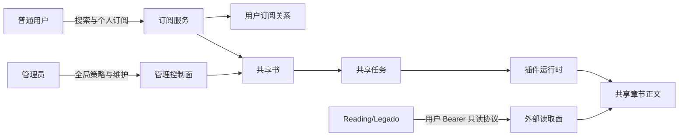

# LegadoHub 项目边界与受控订阅交付契约

> 状态：Accepted，Phase 1 已完成；Phase 4 公网授权边界实施中
> 日期：2026-07-16，2026-07-19 修订公网授权目标，2026-07-21 修订管理员删除语义
> 上位产品真相：`docs/PRODUCT.md`
> 适用范围：后端、Console、Reading/Legado 外部协议、插件运行时、官方插件同步与发布验证

## 1. 文档目的与优先级

本文件把当前产品方向固定为：**面向自托管单实例的书源插件宿主与受控自助订阅阅读中心**。本机和受信局域网仍是默认部署方式；公网只允许使用 Phase 4 定义的受邀用户授权模式，并且必须先通过 `public-reading-authorization-security-plan.zh-CN.md` 的全部发布门禁。

普通用户可以发现并订阅自己想看的书、管理自己的订阅状态和进度起点；普通用户不获得插件、书源、共享抓取任务、全局资源或其他用户数据的管理权。同一本书只维护一份共享正文和一条共享处理链。

### 1.1 主交互面优先级

- **Reading/Legado 是用户阅读书籍的主界面**，负责阅读位置、翻页、字体、主题和阅读交互。
- **Web Console 是订阅与运维控制面**，负责发现、订阅、个人设置、处理进度和管理员维护。
- Console 的章节正文弹窗只用于抽查已处理内容与预览状态，不定义 Web 阅读器产品方向。
- Reading 数据面只能搜索和读取 `visible` 的已发布共享书、目录与正文；打开详情、目录或章节不得创建订阅、入队、注册 TOC、改变发布状态或执行维护。

出现冲突时按以下顺序解释：

1. `docs/PRODUCT.md` 定义产品范围和阶段。
2. 本文件定义角色、所有权、数据、接口、生命周期和实现门禁。
3. `docs/architecture/source-plugin-contract.zh-CN.md` 定义插件协议。
4. 其他计划和进度文档只能提供实现细节，不能覆盖前三项。

下列旧方向自本文件生效后明确失效：

- 通过删除旧 `app.db` 完成版本升级。
- 把 `aggregate_book_tasks.added_by_user_id` 当作订阅或所有权。
- 把用户起始章节、用户暂停或用户自动归档写入共享任务语义。
- 以旧设计稿、旧页面或旧计划恢复已主动清理的功能。
- 让插件拥有宿主级并发、重试、代理、缓存、调度或 Cookie 文件。

## 2. 能力承诺

### 2.1 用户可获得的能力

普通用户可以：

- 登录 Console 并使用订阅发现、我的书库、书籍详情、章节状态和正文抽查。
- 从宿主返回且完成标准化校验的候选中订阅书籍。
- 多次订阅同一本共享书而不重复创建共享书或抓取链。
- 调整自己的 `startChapterIndex`、`autoArchiveOnComplete` 和订阅状态。
- 查看与自己订阅相关的安全摘要：可用正文、预览、失败、待处理和更新时间。
- 在订阅为 `active`、`paused` 或 `archived` 时继续读取已存在且允许访问的正文。

### 2.2 用户明确不能获得的能力

普通用户不能：

- 提交任意书籍 URL、插件 ID、源 URL 或内部章节 ID来绕过候选校验。
- 修改来源优先级、官方源登录、Cookie、插件状态或全局配置。
- 调整共享任务的检查间隔、并发、超时、积压上限、重试和来源映射。
- 立即检查、重建、修复、重新处理、暂停、归档或删除共享书。
- 查看其他用户的订阅设置、搜索事件、运维日志、Trace、源 URL、内部路径或错误上下文。
- 通过猜测 `jobId`、`bookId` 或 `chapterId` 获取额外权限。

### 2.3 管理员能力

管理员在普通用户能力之外，可以：

- 管理插件、官方源认证、Cookie、运行参数和全局订阅政策。
- 查看全部共享书、来源映射、任务状态、错误、Trace 和审计记录。
- 调整共享任务 `updateIntervalMinutes` 与 `backlogChapterLimit`。
- 执行立即检查、暂停、恢复、刷新源映射、修复和重建。
- 在确认影响范围后删除共享书，并级联移除该书的用户订阅。
- 管理用户和全局配额。

Phase 1 不提供“管理员代用户订阅”。若以后增加，必须使用独立接口并同时记录真实操作者与目标用户，不能继续接受普通订阅请求中的任意 `addedByUserId`。

## 3. 参与者与信任边界

| 参与者 | 身份 | 可访问范围 | 不可信输入 |
|---|---|---|---|
| 匿名访问者 | 无会话 | source manifest、授权码兑换、一次性 bootstrap、最小健康检查 | 全部请求字段 |
| 普通用户 | Web Cookie Session 或 Reading Bearer Session | 自己的搜索任务、订阅关系与订阅内容；Reading 可读已发布共享内容 | 搜索词、订阅配置、资源 ID、授权 Header |
| 管理员 | Admin Session | 全局控制面 | 所有手工配置与维护参数 |
| Reading/Legado | 普通用户 Bearer Session | 已发布聚合源的兼容读取面与普通用户订阅入口 | 搜索词、外部 book/chapter ID、Session Token |
| 系统调度器 | 内部服务身份 | 共享任务与章节处理 | 插件结果、文件状态、租约状态 |
| 书源插件 | 受限运行模块 | 声明过的访问能力和自身 Cookie jar | 远端站点响应 |

Reading/Legado 不是管理员，也不拥有部署级共享身份。Phase 4 起，它代表一个现有普通用户，并使用独立 Bearer Session；Web Console 使用同一用户模型的 Cookie Session。公网发布前必须完成个人授权码、TLS、可信代理、Host/Origin 校验、安全 Cookie、限流和容器边界，未通过时仍只允许本机或受信局域网部署。



## 4. 不变量

以下规则必须由数据库、服务端授权和测试共同保证，不能只写在前端：

1. 一个逻辑共享书只有一个稳定 `aggregateBookId` 和一条共享处理链。
2. 一个用户对同一本共享书最多一条订阅关系。
3. 用户暂停、归档或调整起点不能改变共享任务状态，也不能影响其他用户。
4. 管理员暂停共享任务只停止后续抓取；已落盘正文仍可按访问策略读取。
5. 用户自动归档只改变该用户的订阅状态，绝不归档共享书。
6. 用户起始章节只定义个人进度基线和默认阅读入口，不是调度命令。
7. 订阅已有共享书只新增或恢复用户关系，不返回“已入库不能重复添加”。
8. 创建共享书、来源映射、共享任务和首个订阅必须具备事务级幂等性。
9. 资源 ID 不是授权凭据；每次用户读取都必须检查当前订阅关系。
10. 普通用户 DTO 不包含源 URL、Cookie、Trace、内部文件路径、代理信息或其他用户身份。
11. 共享书删除、重建和修复只能由管理员发起，并受任务租约保护；删除必须明确提示会级联移除用户订阅。
12. 数据库升级不得删除现有数据库、共享章节文件或 Cookie。
13. 每类事实只有一个权威写入源；其他副本必须声明为可重建投影或缓存。
14. 官方插件只能从其权威仓库修改后同步，宿主中的同步副本不得手改。
15. Reading/Legado 只消费已发布共享内容；读取请求不得隐式改变订阅、共享任务、目录注册或发布状态。
16. Console 不拥有阅读位置与阅读体验设置，不得把个人处理覆盖率包装成真实阅读进度。
17. Reading/Legado 的资源 ID、bookId、chapterId 和 sourceId 都不是授权凭据；除匿名 source manifest 外，每次读取都必须验证当前用户 Session。
18. 普通用户授权只能访问聚合虚拟源和已发布共享内容，不能把官方或第三方插件 ID 当作公网直读代理。

## 5. 领域边界与数据所有权

### 5.1 五个必须分开的概念

| 概念 | 所有者 | 说明 |
|---|---|---|
| 共享书 | 宿主 | 逻辑书身份、展示元数据、来源映射与发布状态 |
| 用户订阅 | 用户，宿主执行策略 | 用户与共享书的关系及个人设置 |
| 共享任务 | 管理员与调度器 | 抓取、处理、重试、检查节奏和积压控制 |
| 共享章节 | 宿主 | 章节身份、处理状态、正文与来源证据 |
| 阅读位置 | 阅读客户端或未来独立能力 | 上次阅读章节、页内位置，不属于订阅进度 |

Phase 1 先完成概念和行为解耦，不强制立即把 `aggregate_book_tasks` 拆成多张表。物理拆表属于后续债务清理；本阶段禁止再向该表添加任何用户级字段。

### 5.2 Phase 1 订阅关系表

```sql
CREATE TABLE user_book_subscriptions (
    user_id TEXT NOT NULL,
    aggregate_book_id TEXT NOT NULL,
    status TEXT NOT NULL DEFAULT 'active'
        CHECK (status IN ('active', 'paused', 'archived')),
    start_chapter_index INTEGER NOT NULL DEFAULT 1
        CHECK (start_chapter_index >= 1),
    auto_archive_on_complete INTEGER NOT NULL DEFAULT 1
        CHECK (auto_archive_on_complete IN (0, 1)),
    created_at TEXT NOT NULL,
    updated_at TEXT NOT NULL,
    PRIMARY KEY (user_id, aggregate_book_id),
    FOREIGN KEY (user_id) REFERENCES users(user_id) ON DELETE CASCADE,
    FOREIGN KEY (aggregate_book_id)
        REFERENCES aggregate_book_tasks(aggregate_book_id) ON DELETE CASCADE
);
```

必须建立：

- `(user_id, status, updated_at)` 索引，用于“我的书库”。
- `(aggregate_book_id)` 索引，用于管理员查看订阅引用数。
- 所有写连接启用 `PRAGMA foreign_keys=ON`、WAL 和 `busy_timeout`。

旧字段 `added_by_user_id`、`start_chapter_index`、`auto_archive_on_complete` 暂时保留为兼容字段，但从迁移完成后不再作为订阅读写真相。它们只能在后续独立迁移确认无调用者后删除。

### 5.3 共享书身份

- 首选身份是完整的 `(sourceId, sourceBookId)`。
- 同一来源书身份只能关联一个共享书；数据库唯一约束负责最终去重。
- `canonicalName + canonicalAuthor` 只能生成匹配候选，不能无确认地合并实体。
- `chapterIndex` 是排序位置，不是章节身份。
- 章节稳定身份来自共享书、来源与来源章节 ID；目录重排不得自动制造新章节。
- 空 `sourceBookId` 不能进入正式来源映射。

### 5.4 存储真相

| 事实 | 权威存储 | 其他副本 |
|---|---|---|
| 用户、订阅、共享书身份、来源映射、任务与章节状态 | SQLite | JSON/UI 只能投影 |
| 最终可读章节正文 | UTF-8 Markdown 文件 | DB `processed_content` 仅兼容缓存 |
| `metadata.json`、`chapter_index.json` | 可重建文件投影 | 不得反向覆盖数据库状态 |
| `aggregate_payload_json` | 创建/调试快照 | 不得与结构化列双向编辑 |
| 宿主策略 | `backend/config/app_config.json` | 数据库不得保存第二份运行配置 |
| 插件 Cookie | 宿主 CookieStore | 插件目录不得有 `Cookie.json` 真相 |
| 管理与订阅审计 | SQLite 最小审计记录 | 详细过程进入运行日志 |
| 搜索过程事件、调试 Trace | 内存或可清理日志 | 不作为业务事实 |

文件写入的单文件原子性不能替代跨数据库和文件的恢复策略。系统必须能够根据数据库状态与正文文件执行一致性扫描，并把 JSON 投影重建出来。

## 6. 状态与生命周期

### 6.1 用户订阅状态

| 当前状态 | 允许转换 | 语义 |
|---|---|---|
| `active` | `paused`, `archived` | 出现在默认书库，参与个人追更状态 |
| `paused` | `active`, `archived` | 保留阅读与关系，不影响共享任务 |
| `archived` | `active` | 默认进入归档视图，保留阅读与历史 |

Phase 1 不提供硬删除订阅接口。再次订阅已归档书等价于恢复为 `active`。最后一个用户归档后，共享书也不得自动删除；无人订阅仅作为管理员清理候选。

当共享书明确完结、用户选择自动归档、且该用户订阅范围进入终态时，只能把该用户的 `active` 订阅改为 `archived`。`paused` 状态不被系统自动覆盖。

### 6.2 共享任务状态

共享任务状态只表达调度生命周期：

- `active`：允许周期检查和处理。
- `paused`：不创建新周期任务，保留数据。
- `error`：最近一次运行失败，按共享策略重试。
- `archived`：管理员明确停止常规追更，保留内容。

现有 `awaiting_archive` 是用户自动归档污染共享任务的遗留状态，禁止继续扩展，并应在兼容迁移后移除。

### 6.3 不能混用的状态维度

以下维度必须在 API 和 UI 中分开：

- 调度状态：`active/paused/error/archived`。
- 发布状态：`hidden/visible/retired`。
- 来源作品状态：`serializing/completed/unknown`。
- 处理状态：`pending/processing/ready/retry_wait/failed`。
- 内容访问：`full/preview/none`。
- 正文来源：`primary/fallback`。
- 完整性：`accepted/suspect/rejected/unknown`。

`fallback` 不是失败，`preview` 不是完整正文，`suspect` 不是已验证内容，`processed` 也不必然等于用户可读全文。

## 7. 进度契约

### 7.1 用户可调范围

普通用户只能调整：

- `startChapterIndex`：个人进度范围起点。
- `status`：`active/paused/archived`。
- `autoArchiveOnComplete`：个人完结归档策略。

用户不能调整处理速度、检查间隔、并发、重试、来源、backlog 或任务优先级。修改起点只重新派生个人进度，不重建、不删除、不重复抓取正文。

### 7.2 管理员可调范围

管理员可以调整：

- `updateIntervalMinutes`：共享书周期检查间隔。
- `backlogChapterLimit`：单轮最多处理的积压章节数量。
- 立即检查、暂停、恢复、重建、修复和来源映射。

所有值必须在服务端限制范围内。前端输入不是可信策略来源。

### 7.3 进度响应

共享任务摘要至少返回：

```text
totalCount
fullCount
previewCount
failedCount
pendingCount
processingCount
continuousReadyThroughIndex
lastCheckedAt
nextCheckAt
lastProcessedAt
lastErrorSummary
```

个人订阅摘要至少返回：

```text
rangeStartIndex
rangeEndIndex
fullCount
previewCount
failedCount
pendingCount
continuousReadableThroughIndex
coverageRatio
```

`coverageRatio` 的分母是 `[rangeStartIndex, rangeEndIndex]`，分子只能是明确可用的全文或预览数量，并必须同时展示分类计数。UI 不得把 `processedChapters / totalChapters` 标成“阅读进度”，也不得把未知值默认为“已完成”或“异常 0”。

用户的真实阅读位置属于后续独立能力，不得借用 `startChapterIndex` 或进度百分比保存。

## 8. 受控自助订阅流程

1. 用户提交搜索词，宿主创建绑定用户的搜索句柄。
2. 宿主可以在内部复用同词底层搜索，但每个用户只能读取和取消自己的句柄。
3. 搜索结果必须标明：`available`、`already_subscribed`、`already_shared` 或 `unavailable`。
4. 用户只能提交候选 ID和个人订阅配置，不能提交内部来源 URL或共享任务配置。
5. 服务端在一个事务中执行：确认来源身份、确保共享书、确保共享任务、upsert 用户订阅。
6. 已有共享书时只创建或恢复订阅；重复请求返回当前结果，不返回 409。
7. 事务提交后调度器可立即唤醒；即使即时唤醒失败，持久化任务也必须能被周期扫描恢复。
8. 返回 `sharedBookCreated`、`subscriptionCreated`、`bookId`、订阅状态和 `provisioningState`。

### 8.1 资源门禁

普通用户的自助能力必须受宿主政策控制：

- 每用户有效订阅上限。
- 每用户单位时间新建共享书上限。
- 全局处于 provisioning/backlog 的共享书上限。
- 可参与普通用户订阅搜索的来源范围。
- 搜索、订阅和更新接口的速率限制。

订阅一个已存在的共享书不消耗“新建共享书”配额，但仍计入用户有效订阅数。具体额度是运营参数，不属于用户权限，也不允许用户覆盖。当前默认值已经冻结为：每个用户最多 `100` 个有效订阅、每个用户每天最多创建 `10` 本新共享书、全局最多同时存在 `20` 本尚未完成首轮入库的共享书。配置字段分别为 `maxActivePerUser`、`maxNewSharedBooksPerDay`、`maxGlobalProvisioningBooks`；默认值由 `SubscriptionConfig` 提供，管理员可在部署配置中调整，普通用户不能覆盖。

## 9. API 与授权边界

### 9.1 命名空间

- `/api/subscribe/*`：已登录用户的个人订阅和安全阅读 DTO。
- `/api/console/*`：管理员控制面；Phase 1 完成后不再承载普通用户运维读取。
- `/api/legado/*` 与 `/api/subscribe/legado/*`：Reading/Legado 兼容面，使用普通用户 Bearer Session；除 source manifest 外不允许匿名访问。
- `/api/auth/*`：认证、会话与一次性初始化。

普通用户详情和章节接口迁移到 `/api/subscribe` 后，现有 `access="user"` 的 Console 书籍日志、Trace 和进度接口必须改回管理员权限。共享服务层可以复用，响应 DTO 和授权检查不能复用管理员宽权限。

### 9.2 Phase 1 用户接口

```text
POST  /api/subscribe/search
GET   /api/subscribe/search/{jobId}
POST  /api/subscribe/search/{jobId}/cards/{candidateId}/subscribe
GET   /api/subscribe/library/mine
GET   /api/subscribe/books/{bookId}
GET   /api/subscribe/books/{bookId}/chapters
GET   /api/subscribe/books/{bookId}/subscription
PUT   /api/subscribe/books/{bookId}/subscription
PATCH /api/subscribe/books/{bookId}/subscription
```

规则：

- `bookId` 详情和章节读取必须存在当前用户订阅；管理员走管理接口。
- `PUT` 和候选订阅必须幂等。重复订阅返回 HTTP 200 与当前关系。
- `PATCH` 只接受三个用户字段，未知字段返回 422。
- 搜索句柄查询和取消必须检查 owner；管理员诊断走 Console 接口。
- `/api/subscribe/library` 的全局共享列表不得继续向普通用户开放。

### 9.3 HTTP 语义

| 状态码 | 语义 |
|---|---|
| `200` | 成功、幂等重复或当前状态返回 |
| `201` | 明确创建新关系时可选使用 |
| `400/422` | 参数格式、字段或范围错误 |
| `401` | 未登录或部署凭据缺失 |
| `403` | 角色或资源归属不允许 |
| `404` | 资源不存在，或调用者不应获知其存在 |
| `409` | 真实状态转换冲突，不用于“共享书已存在” |
| `429` | 用户额度或速率门禁触发 |
| `503` | 全局容量或依赖暂不可用 |

新增和修改的订阅接口错误使用结构化 `detail`：

```json
{
  "detail": {
    "code": "subscription_limit_reached",
    "message": "已达到当前订阅上限",
    "retryable": false
  }
}
```

不得继续混用 HTTP 200 + `{error}`、HTTP 200 + `status=unknown` 和标准 4xx 表达同一类错误。

### 9.4 Reading/Legado 兼容面

以下属于外部稳定契约：

- `legadohub_ai_aggregate` 虚拟源 ID。
- `legadohub://aggregate/...` 内部 URL 前缀。
- 外部 book/chapter ID 编码。
- book、toc、chapter 和 reviews 响应字段。

这些契约没有兼容测试时不得修改。外部接口只能搜索并读取已发布共享内容；搜索不创建后台源任务，详情、目录和正文读取不写数据库、不入队、不注册 TOC。匿名取消任务、修改订阅或执行维护明确禁止。Reading 使用授权码兑换的 Bearer Session，禁止把授权码、Session Cookie 或 Bearer Token 塞进书源 URL、静态 Header 或导出的书源 JSON。

## 10. 并发、幂等与任务所有权

1. 共享书创建必须由稳定来源身份唯一约束兜底，禁止仅靠“先 SELECT 再 INSERT”。
2. 用户订阅由 `(user_id, aggregate_book_id)` 主键和 upsert 保证幂等。
3. 调度锁必须使用稳定 `aggregateBookId`，不能使用可变的书名和作者。
4. 同一本书的周期检查可以合并；立即检查可以合并到已有检查。
5. 重建、删除和来源映射重置是互斥维护操作，必须等待或拒绝已有处理租约。
6. 租约失效后不得继续写数据库、章节文件或 JSON 投影；每个写批次前重新验证租约。
7. 后台 `asyncio.create_task()` 只能用于加速唤醒，不能成为任务不会丢失的唯一保证。
8. `update_tasks` 与 `SharedBookScheduler` 不得同时拥有同一本聚合书的更新检查。聚合书统一由后者负责；旧调度器仅限明确的遗留非聚合资源，随后退役。
9. 短暂截断的 TOC 不能直接删除已登记章节；删除或缺章必须经过稳定性确认。
10. 所有状态更新应带预期旧状态或版本条件，避免并发请求复活已暂停/归档任务。

### 10.1 高影响操作规则

- 暂停：阻止新周期任务，不删除内容。
- 恢复：只改变共享调度状态，不改变用户订阅。
- 重建：保留 `aggregateBookId`、订阅关系和审计；清理产物必须可恢复。
- 删除：管理员确认后可级联删除 `active/paused/archived` 订阅；存在运行租约时返回 409。
- 物理删除：在数据库事务和文件清理计划中执行；失败必须保留可重试记录，不能伪装成功。

## 11. 插件与宿主边界

### 11.1 宿主负责

- 插件加载与契约校验。
- 全局并发、超时、取消、重试、代理和流量预算。
- Browser 生命周期、Cookie 持久化、全局缓存和健康调度。
- 跨来源 fallback、共享任务、章节存储、审计和用户授权。
- 登录 Cookie 文件路径与清理。

### 11.2 插件负责

- 站点协议、签名、解密、解析和站点内明确 fallback。
- 把远端结果转换为统一 Unicode 数据结构。
- 区分成功空结果、挑战、超时、限流、认证失败和解析失败。
- 认证状态实时探测；只有明确账号名或登录手机号才能返回登录成功。
- 声明所需 HTTP、stealth、browser、proxy、Cookie 和 auth 能力。

### 11.3 明确禁止

- 插件读写宿主数据库、`backend/config/cookies` 或自身 `Cookie.json`。
- 插件创建全局 scheduler、Playwright 实例、代理池、跨请求缓存或无限重试器。
- 宿主按 URL猜测 HTTP 到 Web/Browser 的隐藏回退。
- 插件用空列表或乱码文本掩盖设备错误、认证失效或解码失败。
- 宿主对插件正文进行猜测编码修复；插件必须输出正确 Unicode，宿主统一以 UTF-8落盘。

起点 APP 插件的固定流程是：普通 App 正文接口 -> 在结果不满足契约时尝试 VIP/付费接口；不回退 Web。免费章节必须标识完整正文，付费未购买章节必须标识预览，不能把预览伪装成全文。

### 11.4 官方插件仓库与同步

官方起点插件的权威来源是独立的 `QDFCCKK` 仓库；当前开发机通常位于 `C:\Home\Workspace\UGit\QDFCCKK`，该绝对路径只是本地约定，不是可移植契约。CI 或其他开发环境必须显式提供 checkout 路径。

同步流程：

1. 在 QDFCCKK 修改 WEB/APP 插件和测试。
2. 完成离线、真实 API、登录状态与正文/预览验证。
3. 验证通过后更新插件版本。
4. 使用 `sync-to-legado-hub.py --variant ...` 同步。
5. 在 legado-hub 运行插件校验、宿主测试和真实调用验收。

同步必须在白名单遗漏、metadata/manifest 不一致、能力不匹配或 smoke 失败时失败。复制成功不等于部署成功；同步产物必须可追溯到源仓库 commit。

## 12. 前端边界

### 12.1 普通用户界面

- 只展示订阅发现、我的书库、个人订阅设置和安全阅读状态。
- 订阅确认必须允许编辑起始章节和自动归档，不得硬编码为 `1/true`。
- 搜索结果必须区分已订阅、已共享但未订阅、可创建和不可用。
- 详情页不得请求管理员日志、Trace、来源映射或章节内部处理阶段。
- 查询必须覆盖 loading、empty、partial、timed out、error、403、404 和 retry。

### 12.2 管理员界面

- 展示共享任务、来源、错误、Trace、检查时间和维护操作。
- 管理员按钮根据服务端状态决定是否可执行；前端隐藏不是安全边界。
- 删除必须提示会移除全部用户订阅和章节数据并二次确认；重建必须显示影响范围并二次确认。

### 12.3 数据显示规则

- 禁止把缺失状态默认成 `completed`。
- 禁止把缺失失败数默认显示为“异常 0”。
- 禁止把 `partial/timed_out` 搜索结果显示成完整结果。
- 禁止把全文、预览、fallback、suspect 和失败合并成一个成功数字。
- 禁止为视觉对齐恢复空壳按钮、假数据或已删除能力。
- 行为和权限验收通过后，再更新 98% 视觉回归基线。

## 13. 安全与部署边界

- 仅支持本机或受信局域网单站点部署；外网穿透及其 TLS、代理、防火墙和限流由使用者自行负责，不属于应用模式。
- Phase 1 运行模型限定为单个后端进程；内存限流和进程级共享书创建锁不提供多 worker 一致性。启用多进程前必须改为数据库预留或等价的跨进程协调与持久限流。
- `app_config.json`、Cookie、数据库和运行日志均不得提交；API key 在 UI/API 输出中必须遮罩。
- 本地运行配置可以由宿主保存敏感值，但必须依赖主机文件权限保护，禁止写入源码、测试夹具或日志。
- 使用者自行接入 HTTPS 穿透时必须设置 Session Cookie `Secure`，并正确处理可信代理协议头。
- 个人授权码、Bearer Session、Allowed Hosts、可信代理、Origin/CSRF 防护、速率限制和容器/凭据保护属于局域网多用户实例的基础安全边界。
- bootstrap 必须是数据库事务保护的一次性操作；已有用户后永久拒绝。
- 禁用用户必须立即撤销其全部 Session。
- 日志不得输出密码、Cookie、Authorization、API key、手机号全文或内部正文。

## 14. 可观测性与审计

必须持久化的最小审计：

- 用户订阅创建、状态和设置变化。
- 管理员暂停、恢复、归档、删除、重建、修复和来源映射变化。
- 用户管理、官方源登录与 Cookie 清理。

审计字段至少包括：真实 `actorUserId`、角色、目标类型/ID、操作、before/after 摘要、结果、时间和 correlation ID。管理员代操作若以后实现，必须同时记录 actor 和 target user。

搜索逐源事件、章节逐阶段 Trace 和 HTTP 细节可以保存在内存或可清理日志；它们不能成为状态恢复或权限判定的唯一依据。

运行指标至少覆盖：任务延迟、队列积压、重试、锁获取/续租失败、章节分类计数、插件错误码、订阅创建结果和恢复结果。

## 15. Schema 切换与当前数据决策

### 15.1 历史阻断项（已修复）

旧实现曾把 schema 版本作为字符串比较，并在版本较旧时删除数据库。Phase 1 已改为整数版本和原地事务迁移；迁移、补列、缓存迁移与版本写入失败时整体回滚，任何升级路径都不得恢复删除 `app.db` 的行为。

### 15.2 当前工作区数据结论

2026-07-16 已对 `backend/data/app.db` 做只读计数核查：

```text
aggregate_book_tasks=0
aggregate_chapter_tasks=0
aggregate_book_sources=0
aggregate_operation_logs=0
aggregate_source_snapshots=0
aggregate_ai_usage=0
update_tasks=0
```

当前工作区没有任何需要保留或回填的订阅、共享书、共享章节或共享任务数据。Phase 1 实现可以显式清理订阅域表、共享书目录和对应运行投影，不需要建设旧订阅回填逻辑。

以下数据不属于本次清理授权范围：

- `users` 与 `user_sessions`。
- `backend/config/cookies/` 中的官方源登录 Cookie。
- `backend/config/app_config.json`。
- 插件、词库和其他与订阅域无关的运行数据。

`book_records` 当前仍有搜索/目录缓存数据，但它不是用户订阅关系；是否退役由旧搜索与更新链清理阶段决定，不能借本次订阅 schema 切换顺手删除。

### 15.3 v8 -> v10 原地切换（已完成）

执行顺序：

1. 把 schema 版本解析改为整数，移除“低版本等于删库重建”的行为。
2. 保留现有 `app.db`，在事务中显式清空订阅域遗留行；当前核查结果为 0 行。
3. 清理共享书正文目录和 JSON 投影时只操作已确认的订阅域路径，不触碰 Cookie、配置、用户或 Session。
4. 在事务中创建 `user_book_subscriptions`、约束和索引。
5. 不执行 `added_by_user_id` 回填；当前没有待迁移共享书。
6. 写入 schema version 9并提交；后续 schema 10 仅原地增加最小审计表，同样在单一事务中完成。
7. 验证用户、Session、Cookie、配置和非订阅域数据未变化。
8. 初始化和切换逻辑可重复执行；失败时回滚事务，不删除数据库文件。

旧个人字段暂时保留用于代码兼容，但不携带任何需要保留的数据。相关读写全部迁出后，可在后续独立 schema 变更中删除。

## 16. 技术债与处理原则

| 技术债 | 当前风险 | 本阶段处理 | 触发完整重构的条件 |
|---|---|---|---|
| `aggregate_book_tasks` 混合实体与任务 | 语义继续污染 | 停止新增个人字段，服务层隔离 | 下一次共享任务 schema 大改 |
| DB、JSON、Markdown 多重状态 | 崩溃后漂移 | 固定权威与投影方向 | 完整性扫描无法可靠修复 |
| `book_records/update_tasks` 遗留链 | 重复检查和双真相 | 禁止拥有聚合书 | 无调用者后删除 |
| 书名+作者匹配和锁键 | 误合并、错误互斥 | 身份唯一约束、锁用稳定 ID | 来源身份模型扩展 |
| 搜索任务仅在内存 | 重启丢任务 | Phase 1 只补 owner 隔离 | 产品需要重启恢复时持久化 |
| `console.py`、`aggregate_processor.py` 巨型文件 | 修改冲突和边界漂移 | 不再继续堆职责 | 修改对应领域时按服务边界提取 |
| 前端 `any` 与容错默认值 | 错误状态伪装成功 | 为 Phase 1 DTO 建类型 | 按路由逐步替换，不做全仓重写 |
| 手工插件同步白名单 | 漏文件和不可追溯 | 同步后严格校验 | 新增 runtime 文件或能力时改为 manifest 驱动 |

实现原则：先固定行为和真相，再拆物理结构；先让迁移可恢复，再升级 schema；先用数据库约束保证幂等，再加应用层判断；不为了“未来可能需要”引入新队列、数据库或框架。

## 17. 明确禁止的方案

1. 每个用户复制一套共享书、章节文件或抓取任务。
2. 用 `added_by_user_id` 继续模拟多用户订阅。
3. 用户级设置直接写入 `aggregate_book_tasks`。
4. 用户可调抓取速度、并发、来源、重试或立即处理。
5. 用随机 ID + 先查询后插入实现共享书去重。
6. 仅凭书名和作者自动合并书籍。
7. 把 `chapterIndex`、`jobId`、`bookId` 或 `chapterId` 当作授权凭据。
8. 只在前端隐藏管理员按钮，不做服务端授权与资源归属检查。
9. 普通用户读取全局隐藏书、运维日志、Trace 或来源映射。
10. 共享书仍按某个用户的自动归档设置进入 `awaiting_archive`。
11. 无租约检查地删除或重建共享书，或未明确提示订阅级联影响就删除共享书。
12. schema 升级时删除 `app.db`，或吞掉迁移异常后继续写新版本号。
13. DB、JSON、Markdown 和 payload 同时作为可写权威。
14. 用 HTTP 200 包装所有失败，或把未知状态默认成成功。
15. 让匿名 Reading/Legado 接口取消任务或执行任何状态变更。
16. 插件拥有 Cookie 文件、全局重试、代理池、浏览器生命周期或后台 scheduler。
17. 起点 APP 插件失败后自行回退 Web；跨源回退只属于宿主。
18. 用猜测编码、忽略解密错误或乱码正文“尽量返回内容”。
19. 未完成真实验证就更新官方插件版本或同步到宿主。
20. 为视觉 diff 恢复已清理页面、AI 功能、假数据或无实现控件。
21. 为所有朋友使用同一个共享授权码，或把授权码、Session 写进书源 URL、静态 Header 和导出 JSON。
22. 普通用户通过 `/api/legado` 直接调用 `qidian_com_app`、`qidian_com_web` 或第三方插件章节 ID。
23. 用可选配置重新打开匿名 Reading 读取，或只在前端显示登录而不做服务端门禁。

## 18. 实施顺序

### 18.1 测试节奏

- 不在每写一小段代码后运行完整测试。
- 小任务完成全部范围内修改后，再集中运行一次相关测试。
- 大任务拆成下列明确阶段，每个阶段结束后集中运行该阶段相关测试。
- 排查具体失败时允许运行最小定向检查，但它不替代阶段验收。
- 最终提交、推送或发布前，再统一运行一次 `verify.ps1` 和本阶段要求的完整验证。
- 测试结果必须记录实际命令与结果；没有证据不得宣称通过。

### Phase 1A：迁移安全

- 修复版本比较、整库删除和异常吞噬。
- 按已确认范围清理空的订阅域数据，并原地建立 v9 schema。
- 建立 v8 -> v9 可重复切换及账号、Session、Cookie 保留测试。
- 为新关系启用约束和统一连接参数。

### Phase 1B：订阅领域

- 实现 `get/ensure/update/list_subscription` 服务方法。
- 订阅已有共享书时只 upsert 用户关系。
- 为用户详情、章节读取和搜索任务增加 owner 检查。
- 引入配额与速率门禁。

### Phase 1C：共享任务解耦

- 停止共享处理器读取用户级起点和自动归档语义。
- 管理员设置补检查间隔和 backlog 上限。
- 锁键改为 `aggregateBookId`，明确旧更新调度器边界。

### Phase 1D：前端闭环

- 订阅确认可编辑个人设置。
- 我的书库按关系查询并支持暂停、恢复、归档和设置。
- 用户详情切换到安全 `/api/subscribe` DTO。
- 管理员详情保留共享进度、Trace 和维护能力。
- 修复未知状态、错误态和进度文案。

### Phase 1E：验证与发布

- 完成迁移、并发、权限、进度、管理员操作和外部契约测试。
- 真实 Cookie 验证搜索 -> 订阅 -> 共享入库 -> 正文/预览 -> 阅读。
- 运行 `verify.ps1`、前端视觉回归与全部插件校验。
- 验证通过后再提交、推送和发布。

## 19. 发布门禁

必须通过：

1. 两个用户同时订阅同一本新书，只创建一个共享书和一条共享任务。
2. 两个用户拥有不同起点、状态和自动归档设置。
3. 用户 A 暂停/归档不影响用户 B、共享任务或已有正文。
4. 用户不能读取或修改用户 B 的订阅、搜索句柄和私有状态。
5. 普通用户对所有共享维护接口均为 403；匿名为 401。
6. 重复订阅、重复 PATCH 和并发请求幂等。
7. v8 测试库切换到 v9 后订阅域为空，用户、Session、Cookie 和配置保持不变，重复执行结果不变。
8. 管理员删除存在有效订阅的共享书时级联移除订阅；存在运行租约时仍被阻止。
9. 租约续租失败、进程中断和重复队列消费不会产生双写成功。
10. 全文、预览、失败、待处理和连续可读进度口径一致。
11. 普通用户响应不含源 URL、Trace、内部路径、Cookie 或其他用户信息。
12. Reading/Legado 稳定 ID、URL 和响应兼容测试通过。
13. 起点 WEB/APP 登录只有明确身份才成功；APP 免费全文与付费预览真实调用通过。
14. `verify.ps1`、前端 lint/test/build、插件 validator 和视觉回归通过，且真实运行数据未被测试修改。

## 20. Phase 1 完成证据与后续边界

截至 2026-07-16，已完成：

- v9 原地迁移与空订阅域初始化，不删除现有数据库、用户、Session、Cookie 或配置。
- `user_book_subscriptions` 用户关系、个人起点、暂停/恢复/归档与自动归档策略。
- 同书并发订阅复用一个共享书和一条共享任务，锁键与租约 payload 使用稳定 `aggregateBookId`。
- `/api/subscribe` 用户资源归属与安全 DTO，`/api/console` 管理员维护边界。
- Reading/Legado 只搜索 `visible` 已发布共享书；共享详情、目录、正文直接读取共享文件，不入队、不注册 TOC、不修改订阅。
- Reading 目录和正文分别保留 `isVip`、`isPaid`、`previewOnly` 与 `contentAccess`，不再把 VIP 与预览压缩成同一状态。
- QDFCCKK App 插件按普通正文接口、VIP 正文、付费预览顺序读取且不回退 Web；真实调用已验证免费全文和 VIP 预览。
- Console 已收口为订阅与运维控制面，章节正文仅作为抽查视图。
- 管理员用户、全局订阅配额、单书更新间隔和积压上限已接入；普通用户仍只能调整自己的订阅状态、起点和自动归档。
- 重复 PATCH 无状态变化时不更新时间、不重复写 operation log/audit，也不消耗更新限流；API 并发配额和 owner 隔离已有回归测试。
- 普通用户订阅响应经过递归私有字段扫描，章节正文接口不再暴露 `debug`、来源章节 ID 或内部 URL。
- QDFCCKK WEB `0.1.4`、APP `0.2.5` 离线回归通过并同步；同步运行时文件逐项哈希一致。App 真实验证结果为搜索 20 项、目录 538 章、免费正文 2348 字、VIP 预览 182 字。
- 根目录 `verify.ps1` 最终通过：后端 `281 passed, 5 skipped`，22 个插件 validator 全部通过，前端 `42 passed`、lint/build 通过、依赖审计 0 漏洞。
- Console 39 个视觉场景整体一致率 `99.85%`，每个场景均不低于 98%；最低场景为 `98.25%`。
- 发布前后对 `backend/data`、`backend/config`、`backend/generated`、`backend/runtime` 和遗留插件 Cookie 摘要复核一致，真实用户、Session、Cookie、配置和运行数据未变化。

Phase 1 完成不包含持久化搜索任务恢复和统一数据完整性恢复入口。Phase 4 保留“个人授权码 -> 用户 Session -> Reading Bearer”作为局域网多用户鉴权能力；公网交付方向已取消。
